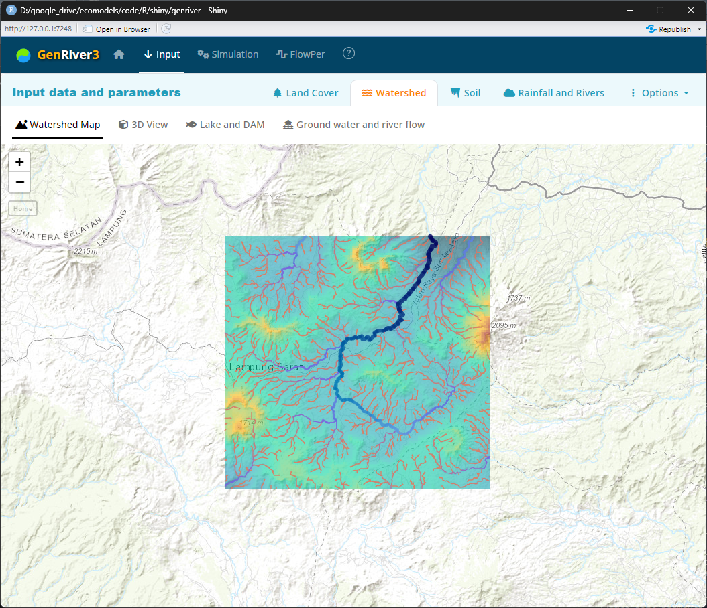

**GenRiver** is a generic river model on river flow.

Run the program by executing this script in R or RStudio:

    shiny::runGitHub("genriver", "degi")

The **online version** is available at: [https://genriver.agroforestri.id/](https://genriver.agroforestri.id/).
> If the server is down due to memory and bandwidth limitations, run the app using RStudio by running the script above.

**User manual** is available at: [https://degi.github.io/genriver/](https://degi.github.io/genriver/) 

## Feature highlights

* The DEM map is provided by the app through [opentopography.org](https://opentopography.org/)  
  
    
     

* The watershed area, stream path, and sub-catchments are generated automatically  
  
    
     

* View the watershed area in 3D 

     

* The soil data is acquired from [FAO - Harmonized World Soil Database version 2.0](https://www.fao.org/soils-portal/data-hub/soil-maps-and-databases/harmonized-world-soil-database-v20) 

     

* The app provides a soil mapping method with automatic procedural segmentation 
  
     

* Soil water is pre-calculated from soil properties data
 
     

* Simulation output in various graphical charts
  
    
    
    
     
