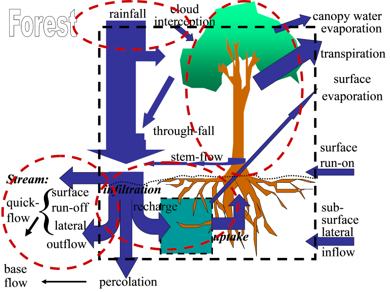
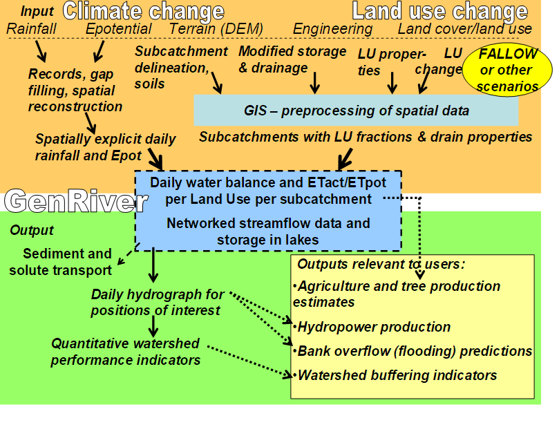
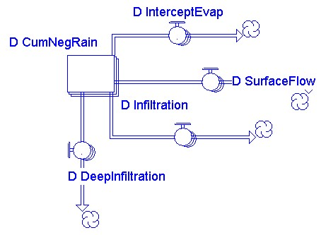
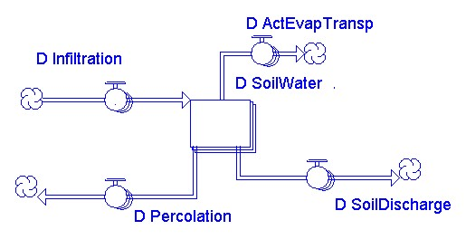

* [Preface](#preface)
* [1. GenRiver Model Overview](#1-genriver-model-overview)
* [2. Description of Model Sectors](#1-description-of-model-sectors)
  * [Why a River Flow Model](#why-a-river-flow-model)
* [3. Flow Persistence and the FlowPer model](#3-flow-persistence-and-the-flowper-model)

## Preface

Water flow in rivers is generated by rainfall and modified by landscape topography, vegetation, and soil, but also by human engineering to enhance drainage and/or retention of water. The degree to which river flow is influenced by land cover change (‘deforestation’, ‘reforestation’, ‘agroforestation’, and other code words) is hotly debated, as is the influence of ‘climate change’. A simple tool that relates the logic at the plot level to the river-level consequences was deemed relevant to assist in the analysis of catchment data. Existing models were either too complex and data-hungry or left out important processes, such as the impact of land use change in the soil and its physical condition.

GenRiver is a generic river flow model that responds to spatially explicit rainfall and keeps track of a plot-level water balance that responds to changes in vegetation and soil. The model treats a river as a summation of streams, each originating in a sub-catchment with its own daily rainfall, yearly land cover fractions, and routing time based on the distance to the river outflow (or measurement) point. Interactions between streams in their contribution to the river are considered to be negligible (i.e. there is no 'backflow' problem). Spatial patterns in daily rainfall events are translated into average daily rainfall in each sub-catchment in a separate module (Spatrain). The sub-catchment model represents interception, infiltration into the soil, rapid percolation into the subsoil, the surface flow of water, and rapid lateral subsurface flow into streams with parameters that can vary between land cover classes.

## 1\. GenRiver Model Overview

Land cover change can significantly affect watershed functions through a) changes in the fraction of rainfall that reaches the ground, b) the subsequent path-ways of water flow over and through the soil as related to surface and subsurface structure of the soil, surface roughness, and landscape drainage, and c) the rate of water use by plants (Fig. 1.1). 

<figure>
  
  <figcaption><b>Figure 1.1</b> Multiple influences of tree cover and (forest) soil condition in terms of the water balance.</figcaption>
</figure>

Simple characteristics of the vegetation (monthly pattern of leaf biomass, influencing canopy interception and transpiration, and ability to extract water from deeper soil layers) and soil (especially compaction of the macro pores in the soil that store water between ‘saturation’ and ‘field capacity’) can probably explain a major part of the impacts on river flow.

Empirical assessment of the dynamics of water flows as a function of land cover change and soil properties takes time and resources, and needs to take temporal and spatial variation of rainfall into account. A model based on ‘first principles’ that integrates land cover change and change in soil properties as driving factors of changes in river flow can be used as a tool to explore scenarios of land use change if it passes a ‘validation’ test against observed data.

<figure>
  
  <figcaption><b>Figure 1.2</b> Landscape-scale processes that relate the spatial and temporal aspects of rainfall to river flow.</figcaption>
</figure>

GenRiver is a generic river model on river flow.  As is common in hydrology, it starts the accounting with rainfall or precipitation (P) and traces the subsequent flows and storage in the landscape, which can lead to either evapotranspiration (E), river flow (Q), or change in storage (ΔS) (Figure 1.3):

P = Q + E + ΔS

Models differ in the relations between the different terms of the balance equation and in the way they account for the ‘slow flows’, that derive from water that infiltrates into the soil but can take a range of pathways, with various residence times, to reach the streams and rivers, depending on landform, geology and extractions along the way.

The core of the GenRiver model is a ‘patch’ level representation of a daily water balance, driven by local rainfall and modified by the land cover and land cover change and soil properties of the patch.  The patch can contribute to three types of stream flow: surface-quick flow on the day of the rainfall event, soil-quick flow on the next day, and base flow, via the gradual release of groundwater.

A river is treated as a summation of streams, each originating in a sub-catch¬ment with its own daily rainfall, yearly land cover fractions, and constant total area and distance to the river outflow (or measurement) point.  Interactions between streams in their contribution to the river are considered to be negligible (i.e. there is no ‘backflow’ problem).  Spatial patterns in daily rainfall events are translated into average daily rainfall in each sub-catchment.  The sub-catchment model represents interception, infiltration into the soil, rapid percolation into the subsoil, the surface flow of water, and rapid lateral subsurface flow into streams with parameters that can vary between land cover classes.

<figure>
  
  <figcaption><b>Figure 1.3</b> Overview of the GenRiver model; the multiple subcatchments that make up the catchment as a whole can differ in basic soil properties, land cover fractions that affect interception, soil structure (infiltration rate), and seasonal pattern of water use by the vegetation. The sub-catchment will also typically differ in ‘routing time’ or in the time it takes the streams and river to reach the observation point of main interest.</figcaption>
</figure>

<figure>
  
  <figcaption><b>Figure 1.4</b> GenRiver model, key types of input, and main output.</figcaption>
</figure>


## 2\. Description of Model Sectors

### Why a River Flow Model

At short time span of most observers of river flow it is difficult to distinguish interannual variability of weather from real change in climate and from changes in land cover and soil conditions.

<figure>
  
  <figcaption><b>Figure 2.1</b> The biophysical relations between rainfall, land use in upper catchments and river flow to downstream.</figcaption>
</figure>

The hydrology of the river basin integrates processes at a range of temporal and spatial scales and the interactions between ‘input’ and ‘water processing’ at patch and river channel scale are not easily unraveled. Purely empirical (data driven) models may need only  a few parameter to reconstruct a daily hydrograph from rainfall data, but because their parameter cannot ‘unpacked’ at the land use level, such models are not  suited for scenario models where the effect of land cover change (including forest cover) are the main interest (Croke, et. al., 2004).

Spatially explicit models that make use of a basic of understanding of the underlying mechanisms tend to require a large number of spatially explicit parameters more than normally available. If such models are used for ‘model optimization’ there may be to many degrees of freedom for improving the model fit (‘survival of the fitter’), and it is hard to decide which among a range of parameterization options to use for subsequent scenario studies (Thanapakpawin, P., et. al. 2005).

The term ‘watershed functions’ is often used in a rather loose way, suggesting that its various aspects (dimensions) change in a similar way when we make comparisons across climatic zones, land forms and human-induced land cover change. In reality, however, changes in total quantity of water may not be of the same relative magnitude (or even sign) as changes in quality or regularity of flow, and a differentiation among the ‘functions’ is needed. The ‘functionality’ of various aspects of river flow depends on the perspective, however, and thus may differ between various stakeholders. So, we may want to restrict ourselves to the hydrological ‘consequences’ of a watershed, and leave the value judgements of ‘functions’ to a later step in the analysis. The three main outcomes of current interest are:

* Quantity or total water yield  
* Evenness of flow, which implies high flows in the ‘dry’ season and an absence of strong peak flows in the wet season  
* Quality of water, with respect to its use as drinking water, other domestic uses, industrial use, irrigation or as habitat for fish and other water organisms

The behaviour of streams and rivers in these respects can be seen as the consequence of:

1. **Site properties that ‘come with the territory’**  
   * local rainfall regime (and its temporal autocorrelation or tendency for wet days to follow wet days)  
   * slope  
   * soil depth and texture, determining the potential water storage, transport and retention  
   * underlying landscape and geology that determines potential storage and release of groundwater  
   * inherent properties of the riverbed  
2. **Scale**  
   * size of the catchment (upstream of the observer/stakeholder) relative to the spatial autocorrelation of rainfall  
3. **Land use that directly depend on human activities**
   * infiltration and supply to groundwater as potentially influenced by soil structure that itself depends on vegetation and land use  
   * vegetative aspects of the properties of the riverbed (and temporary storage) that dominate pulse transmission  
   * irrigated agriculture and horticulture based on extractions from rivers  
4. **Engineering structures**  
   * canalisation of streams and rivers, increasing the rate of drainage  
   * regulating structures in the river  
   * impediments to rapid drainage in the form of dams and reservoirs

Where much of the public debate attributes most of the changes in ‘watershed functions’ to a change in forest cover (deforestation or reforestation), we need tools to account for the interactions of all four aspects mentioned here, to help us in assessing the causality of changes and the opportunities for interventions.

Various approaches exist for modelling watershed functions, ranging from directly data-driven (empirical) approaches to models based on concepts of a water balance, soil physics and hydrology. Models differ by temporal and spatial scale: detailed description of rainfall and infiltration may require a minute (or even seconds) time step, especially on slopes where water will become surface runoff if it cannot infiltrate within seconds of reaching the soil surface. At the other end of the spectrum we may find empirical equations relating annual water yield of a catchment to annual rainfall (or precipitation in climate zones where snowfall and ice rains are significant). For some Indonesian catchments, for example, an empirical equation (Rizaldi Boer, pers. comm.) was derived as:

Q \= 0.94 P – 1000 mm year –1

with Q as river flow and P as precipitation both in mm year –1. A tentative interpretation of these coefficients is that 6% of rainfall is lost through interception and direct evaporation from wet leaf surfaces and/or a rainfall-dependent increase in plant transpiration, and that the basic value for annual evapotranspiration is 1000 mm year –1. Both these parameters, the interception loss, and the evapotranspiration will vary with the temporal distribution of rainfall and the land cover type, but the intercept is unlikely to change by more than 50% of the values given (so the intercept in unlikely to be more than 1500 or less than 500 mm year-1), while the slope is probably confined to the range 0.8 – 1\. The simple model may thus be fairly robust, but it is not sensitive to changes in land use or land cover (these could shift the parameters from the indicated values), and cannot be directly ‘downscaled’ to shorter periods of time (as it does not consider changes in storage terms). More sophisticated models will need to be explicit in the basic value for evapotranspiration of different types of land cover, and the degree to which these land covers induce direct evaporative losses.

<figure>
  
  <figcaption><b>Figure 2.2</b> The biophysical relations between rainfall, land use in upper catchments and river flow to downstream areas are subject to discussions between downstream and upland people whose perceptions on the cause-effect relations are reflected in policies that may aggravate poverty and conflict.</figcaption>
</figure>

Four classes of land cover can be distinguished from the perspective of evapotranspiration : 

* **open water bodies**
  
	where water loss is determined by the relative humidity of the air and the presence of a stagnant boundary layer of air that reduces the transport of water vapour

* **open soil**
  
	which may have a rate of evaporation similar to open water bodies when the surface is wet, but where evaporation may rapidly become limited by the rate of transport to the soil surface; soil cover with a litter layer provides a stagnant air zone, further reducing transport opportunities and mixing with the atmosphere

* **seasonally green vegetation**
  
	most plants are able to provide their leaves (evaporating surfaces) with the amount of water that is needed for evaporation similar to an open water surface, during most of the rainy season; during periodic dry spells, plant transpiration is likely to drop below the value of open water, but stay above that of open soil

* **evergreen vegetation**
  
	such as evergreen trees (e.g. pines, eucalypts, trees such as grevillea), irrigated rice paddies or vegetable crops will have a rate of transpiration equal to that of open water, or higher if lateral flows of dry air drive the evapotranspiration per unit area to higher levels

If we take for granted that effects of local land use on total annual rainfall are small, the main effect on total water yield of a catchment area is a change in the rate of evapotranspiration, or the return flow of water molecules to the atmosphere. In a simple equation: Q \= P – E \-  S or the total water yield (surface rivers Qr \+ subsurface lateral flows Qs \+ groundwater flows Qg) equals precipitation (rainfall plus snow and ice, which in most parts of the tropic can be ignored) minus evapotranspiration minus the changes in storage terms of water in the catrchment. If the time frame for evaluation is sufficiently long relative to the variability of rainfall (e.g. one year for predictable humid climates but multiple years for more erratic drier areas), the S term can be ignored. 

Efforts of land users that will reduce evapotranspiration and thus increase total water yield may thus be found in not planting evergeen trees (especially fast growing ones), or not irrigating rice paddies or vegetable crops in the dry season.

By expressing the rainfall and river flow in mm year-1 we essentially use volume of water per unit area as the basis for calculations; if we consider larger areas, where both rainfall and evapotranspiration vary with space, we will need to make an effort to adjust the average value to maintain validity of the equation. For annual water yield, however, an area-based approach to scaling is valid, and values per unit area can be used to estimate values for any scale through multiplication with area. For properties such as ‘evenness of flow’ or probability of flooding, the relation with the scale of consideration is more complex, and a greater sensitivity to both the mean value of land cover fractions as well as the spatial organization of the landscape is probably needed.

If a greater model sensitivity to land use change is important for the question we try to answer or if we are interested in phenomena operating at shorter time scales than a year, we need to take into account the intermediate processes that determine the access to and use of water stored in the soil and the upper groundwater, as well as the rates of transport and temporary storage of water in the river network. The basic framework for a patch or plot level water balance (Figure 4.3) is well accepted, so the various models differ in the details of the time course of describing canopy interception and throughfall, and the way lateral flows over the surface and through the soil are described. As most plot level studies exclude surface inflows, there is a tendency to focus on surface runoff rather than run-on or net transport.

<figure>
  
  <figcaption><b>Figure 2.3</b>The basic framework for a patch or plot level water balance.</figcaption>
</figure>

**Table 2.1** Models concepts of river flow

|                                                                             | Single scale                                                                               | Spatially explicit, multiple entities at the same scale         | Across scale                                         |
| :-------------------------------------------------------------------------- | :----------------------------------------------------------------------------------------- | :-------------------------------------------------------------- | :--------------------------------------------------- |
| Empirical, catchment specific                                               | Hydrograph analysis, runoff fraction at plot level,  USLE, ‘Parsimonious’ catchment models | Spatial correlation of rainfall,  USLE applied to GIS grid data | Nested hydrograph analyses,  Sediment delivery ratio |
| Based on water balance and generic principles of soil physics and hydrology | Plot-level water balance,  Catchment-level water yield model                               | GIS: raster or polygon based                                    | Nested models with explicit scaling rules            |

A number of existing models address only a single scale, be it a plot or a catchment as a whole (Table 4.1). Other models use a grid-cell approach with interactions between ‘cells’ leading to emergent behaviour at the catchment scale. A third category of models addresses the cross-scale questions in a more direct way by being specific on how properties change with the temporal and spatial scale of consideration.

### GenRiver Model

The model was initially designed as a ‘simple’ (few parameters) model that still has a link to process-based models, and that can be gradually spatially differentiated, as the need arises.

<figure>
  
  <figcaption><b>Figure 2.4</b>Overview of the GenRiver model; the multiple sub-catchments that make up the catchment as a whole can differ in basic soil properties, land cover fractions that affect interception, soil structure (infiltration rate) and seasonal pattern of water use by the vegetation. The sub-catchment will also typically differ in ‘routing time’ or in the time it takes the streams and river to reach the observation point of main interest.</figcaption>
</figure>

The core of the model is a ‘patch level representation of a daily water balance, driven by local rainfall and modified by the land cover and soil properties of the patch. The patch can contribute to three types of stream flow: surface-quick flow on the day of the rainfall event, soil-quick flow on the next day and base flow, via the gradual release of groundwater (Figure 4.4).

**Table 2.2.** The overall water balance of the model, summed over space and time

| In                                                           | Out                                                                              |
| ------------------------------------------------------------ | -------------------------------------------------------------------------------- |
| P \= precipitation (Rainfall)                                | E \= Evapotranspiration                                                          |
| \- Δs \= Changes in soil and groundwater storage             | Q \= River debit (summed over base flow, soil quick flow and surface quick flow) |
| \- Δr \=Changes in the volume of water in streams and rivers | ε \= Error (***unaccounted for***) term (difference between all in & out terms)  |

For the long-term behaviour the changes in soil and groundwater storage, as well as changes in the volume of streams and rivers will be negligible, while the error term should be negligible at all times if the model is correctly implemented.

Many models for river flow, especially for drier areas, focus on the overland flow directly after rainfall (Quickflow) but do not account for the ‘slow flows’, that derive from water that infiltrates into the soil but can take a range of pathways, with various residence times, to reach the streams and rivers, depending on land form, geology and extractions along the way. To keep things simple, GenRiver distinguishes only two steps in this: a soil quick flow (or ‘inter flow’) that is considered to reach the streams a day after the rainfall event, and a ‘slow flow’ that forms a fraction of the available store of groundwater (leading to an exponential decline of the groundwater store with time and a linear relation ship between the logarithm of the discharge and time in the absence of rainfall).

The GenRiver model was made for data-scarce situations and is therefore based on ‘first principles’, as these may be considered the safest bet for a wide range of applications (acknowledging that directly empirical models may have greater precision within the tested range). The model includes an attempt to relate across spatial scales (Figure 4.5).

### Two alternative explanations for steady-river flow

Everybody is probably familiar with the ‘mental model’ of the forests as a sponge, that receive rainfall and gradually feed it to the stream. The concept, clearly formulated in the 1920’s in Indonesia, but is essence much older than that, has been seriously questioned in the 1930’s and internationally in the last two decades (Calder, 2002). The validity of the concept is especially questionable for the humid tropics, where the sponge will be continuously wet and not able to absorb much of the incoming rainfall. Yet, the ‘sponge’ concept still leads to specific expectations that only ‘forest’ can play this role. If we accept that some forms of ‘non-forest’ can maintain infiltration rates, the ‘local buffering’ perspective still leads to strong concerns against any land use intervention that reduces the residence time of water in the system, on its way from rainfall to the river.

There is, however, an alternative explanation for even river flow patterns, that gets much less attention: spatial heterogeneity of rainfall. Simply said: if today it rains here and tomorrow there, the river that receives water from both areas may have a fairly steady flow, despite a poor buffering in either areas (Figure 4.6). If this second model dominates, changes in river flow may be due to a change in the spatial correlation of rainfall, not to land use change in any of the subcatchments per see.

<figure>
  
  <figcaption><b>Figure 2.5</b>Models for watershed functions at catchment scale need to combine explicit rules for effects of land use on interception, infiltration and transport to the stream network at ‘patch’ scale, with assemblage and filter rules that reflect the river network and the changes that this can cause to the overall flow.</figcaption>
</figure>

A distinction between these two types of explanation for patterns in river flow is thus essential to evaluate the likely impact of current land use change in forested areas and the types of interventions that may be effective or not. The relative importance of the two explanations clearly depends on the scale of consideration. In small subcatchments there is hardly any space for the second explanation, and the first must dominate. 

In areas of several hundreds of square kilometers or at subcontinental scale, the second reason is likely to dominate. So, somewhere at intermediate scale the two may break even – can we assess where this occurs? Unfortunately, most past research was done in small plots and in ‘scaling up’ the possible impact of the second explanation was not recognized. In summarizing data in land use impacts on river flow (Kiersch and Tognetti, 2002\) no cases were reported with measurable impacts of land use change on river flow of areas larger than 100 km2.  
	  
The GenRiver models were first designed to answer this rather specific question: how does spatial variability of rainfall influence the ‘evenness’ of river flow that is often attributed to forests as dominant land cover?, or ‘explanation 2’. We first of all need a representation of rainfall with spatial patterns that are intermediate between uncorrelated random and fully coupled. We then need to link this to a model that includes the ‘sponge’ in its essential form, so that we can compare the relative importance of both processes. The two tools described here, GenRiver were developed for such a purpose. We will briefly outline the conceptual basis of both, describe the model implementation and parameter sensitivity, and then proceed with the analysis of the relative impacts of land use change on river flow in catchments with spatially heterogeneous rainfall.  
 
<figure>
  
  <figcaption><b>Figure 2.6</b>Two alternative models for steady river flow:  the ‘sponge’ and ‘patchy rain’ version that are likely to dominate at the scale of plot level research (left) and at landscape scale (right).</figcaption>
</figure>

**Table 2.3.** Well-documented impacts of land use change by basin size (Kiersch and Tognetti, 2002); x \= Measured impact; \- \= No well-documented impact

|                      | Impact Type Basin size \[km\] |       |        |         |         |         |         |
| -------------------- | ----------------------------- | ----- | ------ | ------- | ------- | ------- | ------- |
|                      | **0.1**                       | **1** | **10** | **102** | **103** | **104** | **105** |
| Thermal regime       | x                             | X     | \-     | \-      | \-      | \-      | \-      |
| Pathogens            | x                             | X     | x      | \-      | \-      | \-      | \-      |
| Average flow         | x                             | X     | x      | x       | \-      | \-      | \-      |
| Peak flow            | x                             | X     | x      | x       | \-      | \-      | \-      |
| Base flow            | x                             | X     | x      | x       | \-      | \-      | \-      |
| Groundwater recharge | x                             | X     | x      | x       | \-      | \-      | \-      |
| Organic matter       | x                             | X     | x      | x       | \-      | \-      | \-      |
| Sediment load        | x                             | X     | x      | x       | \-      | \-      | \-      |
| Nutrients            | x                             | X     | x      | x       | x       | \-      | \-      |
| Salinity             | x                             | X     | x      | x       | x       | x       | x       |
| Pesticides           | x                             | X     | x      | x       | x       | x       | x       |
| Heavy metals         | x                             | X     | x      | x       | x       | x       | x       |

### Quantification of ‘buffering’ of river flow by watershed areas

A basic concept in ‘watershed functions’ is ‘evenness of river flow’, indicating low peak flows’ and high ‘base flows’. The variation in river debit between different rivers, however, is largely due to variation in rainfall, and it is no trivial task to separate this climatic effect (that we assume to be independent of local land use change, for the time being at least) from the impacts of land use change. The following definition of ‘buffering’ can allow us to make this separation.

An efficient way of presenting the input and output of a watershed area in a single graph, is to look at the exceedance probabilities for daily rainfall, daily evapotranspiration and daily river flow. If a sufficiently long time period is considered (at least 1 year), changes in storage in soil, groundwater and surface water may be negligible and the areas to the left of the curves for rainfall and evapotranspiration \+ river flow should be approximately equal. The point of intersection has to have an X-value that equals the mean daily rainfall. The intersection would be at an exceedance probability of 0.5 if rainfall distribution were symmetrical and there would be no dry days – in reality skewness of rainfall distribution plus the fraction of days without rain cause the point of intersection to have a value on the Y-axis that is above 0.5.

In an ‘asphalted’ watershed, the river flow curve may be expected to coincide with the rainfall curve and there is no buffering. In an ideally buffered situation the river flow may be constant and equal to the mean at every day of the year. In between these two extremes we’ll find real watersheds with a partial ‘buffering’.

### Target properties of the model

The model was developed with the following target properties. The model should be:

* based on solid principles of the plot-level water balance and the way this is influenced by land use change, through vegetation and changes in soil structure over time preferably compatible in approach to the WaNuLCAS model that operates at higher spatial resolution of soil  zones and layers for mixed copping and Agroforestry situations  
* handling processes at less-than-hourly time scale where infiltration is concerned and at daily time scales for stream and river flow  
* applicable to multiple subcatchments that together form a catchment and that receive rainfall events partially correlated (so in between the assumptions of ‘homogeneity’ and ‘statistical independence’)  
* applicable to any land form and digital elevation model (DEM) at ‘parameter’ level, rather than by modifying model structure  
* able to predict river flow (hydrograph) at multiple points of interest  
* transparent in structure (assumptions) and easy to operate

### Description of GenRiver Component and its Processes

A river is treated as a summation of streams, each originating in a subcatchment with its own daily rainfall, yearly land cover fractions and constant total area and distance to the river outflow (or measurement) point. Interactions between streams in their contribution to the river are considered to be negligible (i.e. there is no ‘backflow’ problem). Spatial patterns in daily rainfall events are translated into average daily rainfall in each subcatchment in a separate module. The subcatchment model represents interception, infiltration into soil, rapid percolation into subsoil, surface flow of water and rapid lateral subsurface flow into streams with parameters that can vary between land cover classes.

GenRiver model consists of several sectors, which are related to one another. Those sectors are:

1. **Water Balance** is a main sector that calculating the input, output, and storage changes of water in the systems. Some components which are in this sector, rainfall, interception, infiltration, percolation, soil water, surface flow, soil discharge, deep infiltration, ground water area and base flow   
2. **Stream Network** is a sector that estimating the flow of water from the river to the final outlet. Some components which are in this sector, total stream in flow, routing time, direct surface flow, delay surface flow, river flow to final outlet.  
3. **Land Cover** is a sector to generate land cover data per sub catchment for each year.  
4. **Subcatchment Parameter** is a sector stored constant parameters that control to the changes of water balance, land cover dan stream network. 

### Water Balance

#### Rainfall

Rainfall at subcatchment level is implemented as daily amounts (I\_RainPerDay) from long time records for each subcatchment, stored in an excel spreadsheet (Table 4.4.). The daily rainfall at the sub-catchment can be either derived from actual data or from a “random generator” that takes temporal patterns into account (SpatRain Model). The actual data is stored and distributed in ‘I\_DailyRainYear…’ parameters, while rainfall derived from SpatRain Model is stored in “I\_SpatRain…” parameters. Each parameter consists four years data as this is the maximum data can be load into STELLA. This option can be decided by switch on I\_UseSpatVarRain? into 0 (actual data) or 1 (SpatRain data).

**Table 2.4.** Rainfall input table in excel spreadsheet

| Days     | Year 1 – 4 | Year 5 \- 8 | Year 9 \- 12 | Year 13 \- 16 | Year 17 \- 20 | Year 21 \- 24 | Year 25 \- 28 | Year 29 \- 32 |
| -------- | ---------- | ----------- | ------------ | ------------- | ------------- | ------------- | ------------- | ------------- |
| **1**    | 2.84       | 6.45        | 27.08        | 7.54          | 8.55          | 6.89          | 17.21         | 5.65          |
| **2**    | 12.38      | 10.18       | 5.05         | 9.43          | 6.27          | 6.65          | 3.64          | 15.42         |
| **3**    | 9.03       | 11.42       | 3.21         | 10.70         | 10.19         | 9.46          | 9.84          | 3.46          |
| **4**    | 5.08       | 16.51       | 1.25         | 12.11         | 1.84          | 0.88          | 13.99         | 8.88          |
| **5**    | 0.22       | 16.71       | 2.10         | 12.14         | 6.96          | 0.73          | 1.81          | 3.61          |
| **6**    | 9.46       | 17.87       | 5.91         | 23.09         | 11.97         | 4.81          | 1.38          | 4.46          |
| **7**    | 13.47      | 2.78        | 2.81         | 31.64         | 7.80          | 3.85          | 1.32          | 3.41          |
| **…**    | …          | …           | …            | …             | …             | …             | …             | …             |
| **…**    | …          | …           | …            | …             | …             | …             | …             | …             |
| **1460** | 0.00       | 7.34        | 7.79         | 4.46          | 1.76          | 8.29          | 0.02          | 0.00          |

<figure>
  
  <figcaption><b>Figure 2.7</b>Implementation process of daily rainfall at subcatchment level from long time records.</figcaption>
</figure>

	I\_RainPerDay \= if I\_UseSpatVarRain? \= 1 then I\_SpatRainTime\[i\] else I\_DailyRain\[i\]

Rainfall at subcatchment level for each landcover type (I\_ DailyRainAmount) directly calculated proportionally to the area (I\_RelArea) and type of each landcover (I\_FracVegClassNow). 

	I\_Daily Rain Amount \= I\_RainPerDay\[i\] x I\_FracVegClassNow\[j,i\] x I\_RelArea\[i\]

Another parameter that has relation with rainfall is rainfall duration (I\_RainDuration). Rain duration is estimated from the daily amount (I\_RainPerDay), and rainfall intensity for the given day (mm hour\-1) that is derived from a mean value (I\_RainIntensMean), a coefficient of variation (I\_Rain\_IntensCoefVar) and a random number (I\_Rain\_GeenSeed). 

	I\_RainDuration \= (I\_RainPerDay\[s\]/I\_Rain\_IntensMean) x MIN(MAX (0,1-3 x I\_Rain\_IntensCoefVar, NORMAL(1,I\_Rain\_IntensCoefVar,I\_Rain\_GenSeed+11250)), 1+3 x  I\_Rain\_IntensCoefVar)

Rainfall duration determines the ‘fraction of time available for infiltration’ (I\_RainTimeAvForInf), this can also be modified by canopy interception of rainfall followed by the duration of the ‘dripping’ phase (D\_RainIntercDelay).

	I\_RainTimeAvForInf \= min(24,I\_RainDuration\[i\]+D\_RainIntercDelay\[i\])

Rainfall will be distributed to each component of water balance, interception-evaporation (D\_InterceptEvap), infiltration (D\_Infiltration), deep infiltration (D\_DeepInfiltration) and run off (D\_SurfaceFlow).

<figure>
  
  <figcaption><b>Figure 2.8</b>Water balance in soil surface level.</figcaption>
</figure>
	   
#### Interception

Evaporation of intercepted water (D\_InterceptEvap) has priority over plant transpiration demand. The proportionality factor for reducing plant transpiration demand on the basis of evaporation of intercepted water can be less than 1 (reflecting the typical time of day of rainfall). The number of interception evaporation value is directly proportional with the storage capacity of land cover class (I\_CanIntercAreaClass) and the daily rain amount (I\_DailyRainAmount).

	D\_InterceptEvap \= I\_CanIntercAreaClass\[j,i\] x (1-exp(-I\_DailyRainAmount\[i,j\]/I\_CanIntercAreaClass\[j,i\]))

The thickness of the water layer that can be stored on leaves and branches (I\_InterceptClass) is treated as a constant value for each land cover type and thus the interception storage capacity  is linearly related to leaf area index and it is reflected by its land cover type (I\_FracVegClassnow). 

	I\_CanIntercAreaClass \= I\_InterceptClass\[j\] x I\_FracVegClassNow\[j,i\] x I\_RelArea\[i\]

#### Infiltration

Infiltration is calculated as the minimum of: 

* the daily potential infiltration capacity (I\_MaxInfArea) times the fraction of a day that is available for infiltration (I\_RainTimeAvForInf) (the latter reflects rainfall intensity as well as the local storage capacity of the soil surface)  
* the amount that can be held by the soil at saturation (I\_SoilSatClass) minus the amount already present (D\_SoilWater)  
* the amount of water that can reach the groundwater level within a day (I\_DailyRainAmount-D\_InterceptEvap)  
* When the surface soil layers are saturated, the rate of outflow will determine the possible rate of inflow on the next day.

```
D\_Infiltration \= if L\_Lake?\[Subcatchement\]=1 then 0 else min(min(I\_SoilSatClass\[j,i\]-D\_SoilWater\[j,i\],I\_MaxInfArea\[j,i\] x I\_RainTimeAvForInf\[i\]/24), I\_DailyRainAmount\[i,j\]- D\_InterceptEvap\[j,i\])
```

If the first constraint is active, the model generates ‘infiltration limited runoff’, in the second case ‘saturation overland flow’.

Infiltration capacity (I\_MaxInfArea) driven by maximum infiltration area (I\_MaxInf) in patch water balance of GenRiver. The change of the parameter due to land cover change over the time was estimated by power equation and soil bulk density relative to the reference bulk density. 

	I\_MaxInfArea \= I\_MaxInf x I\_RelArea\[i\] x I\_FracVegClassNow\[j,i\] x (0.7/I\_BD\_BDRefVegNow\[i\])I\_PowerInfiltRed.

where I\_PowerInfiltRed set with range value 3 to 3.5. 

The reference bulk density is derived from a pedotransfer function with soil texture (clay and silt) and soil organic matter (SOM) as the main inputs . The BD/BDref ratio depends on land cover, with defaults values: 0.7 for the forest soil, 1 for well manage agricultural soil and 1.3 for compacted and degraded soil (Van Noordwijk et al, 2002). Generic estimation of bulk density reference per soil type is: 

	If ((Clay+silt)\>50 then:  
	BDref1 \= 1 / (1.984 \+ 0.01841 x (SOM) \+ 0.032 x 1 \+ 0.00003576 x (Clay \+ Silt)2 \+ 67.5 / 290 \+ 0.424 x LN(290))

	if ((Clay+Silt)\<50 then:   
	BDref2=1 / (0.603 \+ 0.003975 x Clay \+ 0.00207 x SOM x SOM \+ 0.01781 x LN(SOM)))  
			  
#### Deep Infiltration

The amount of deep infiltration is calculated as the minimum of:

* the soil saturation (I\_SoilSatClass), soil water (D\_SoilWater), infiltration of subsurface (D\_Infiltration), rainfall amount (I\_DailyRainAmount).  
* the amount of infiltration of subsurface (I\_MaxInfSubSAreaClass)  
* unfilled area of ground water (I\_MaxDynGWArea)

```
D\_DeepInfiltration \= min(min(min(ARRAYSUM(I\_MaxInfArea\[\*,i\]) x I\_RainTimeAvForInf\[i\]/24-ARRAYSUM(I\_SoilSatClass\[\*,i\])+ARRAYSUM(D\_SoilWater\[\*,i\]),  ARRAYSUM(I\_MaxInfSubSAreaClass\[\*,i\])),ARRAYSUM(I\_DailyRainAmount\[i,\*\])-ARRAYSUM(D\_InterceptEvap\[\*,i\])-ARRAYSUM(D\_Infiltration\[\*,i\])),I\_MaxDynGWArea\[i\]-D\_GWArea\[i\])
```

#### Surface Flow

When the net rainfall (rainfall minus interception-evaporation (D\_InterceptEvap)) exceeds the infiltration capacity of the soil (D\_Infiltration and D\_DeepInfiltration) possibly become surface flow (D\_SurfaceFlow). 

	D\_SurfaceFlow \= if L\_Lake?\[i\]=1 then ARRAYSUM(I\_DailyRainAmount\[i,\*\]) else 
 	ARRAYSUM(I\_DailyRainAmount\[i,\*\])-ARRAYSUM(D\_InterceptEvap\[\*,i\])-ARRAYSUM(D\_Infiltration\[\*,i\])-D\_DeepInfiltration\[i\]

#### Soil Water

During a rain event the soil may get saturated, but within one day it is supposed to drain till ‘field capacity’ (with an operational definition of the soil water content 24 hours after a heavy rainfall event). The difference between saturation and field capacity can be either:

* Used for transpiration (but canopy intercepted rainfall takes priority to meet the demand) (D\_ActEvapTransp)  
* Drain to the groundwater reserve, calculated as the minimum of the amount that can be transported downwards and the fraction of soil water that will drain on any given day (D\_Percolation)  
* Drain to the rivers as ‘soil quick flow’: any water left above field capacity by the two preceding processes (D\_SoilDischarge)

<figure>
  
  <figcaption><b>Figure 2.9</b>The process of soil water dynamic.</figcaption>
</figure>

After a rain event, the soil starts to drain and will reach field capacity after one day (or depending on further parameter 1-3 days). The water held between saturation and field capacity is distributed in the order transpiration, drainage to the groundwater reserve or drain to the rivers as “soil quick flow” (van Noordwijk et al, 2003). The Soil water retention curve (saturation, field capacity, wilting point) is estimated based on pedotransfer functions using the soil type to indicate the soil texture. The groundwater was driven by the ‘differential storage’ in ‘active groundwater’ and the groundwater release’ fraction which representing the recession phase of actual river flow during periods without rainfall.

#### Actual Evapotranspiration

The amount of actual evapotranspiration is proportionally changed by potential evapotranpiration (I\_PotEvapTransp), available soil water (D\_RelWaterAv) and transpiration of intercepted water (I\_InterceptEffectonTransp x D\_InterceptEvap).

	D\_ActEvapTransp \=  (I\_PotEvapTransp\[j,i\]-I\_InterceptEffectonTransp x D\_InterceptEvap\[j,i\]) x D\_RelWaterAv\[j,i\]

#### Percolation

The amount of percolation is calculated as the minimum of:  
Maximum infiltration of subsurface area (I\_MaxInfSubSAreaClass)  
Soil water which can percolate into ground water (D\_SoilWater x I\_PercFracMultiplier x I\_GWRelFrac)  
Unfilled area of ground water (I\_MaxDynGWArea-D\_GWArea)

	D\_Percolation \= min(I\_MaxInfSubSAreaClass\[j,i\], min(D\_SoilWater\[j,i\] x I\_PercFracMultiplier x I\_GWRelFrac\[i\],I\_MaxDynGWArea\[i\]-D\_GWArea\[i\]))\- D\_IrrigEfficiency\[i\] x D\_Irrigation\[i,j\] else \- D\_IrrigEfficiency\[i\] x D\_Irrigation\[i,j\]

#### Subsurface flow or soil discharge

Unused soil water by plants has potential to become sub surface flow or soil discharge (D\_SoilWater-I\_AvailWaterClass). The actual of soil discharge depend on how fraction of soil discharge is initialized (D\_SoilQFlowRelFrac).

	D\_SoilDischarge \= D\_SoilQflowRelFrac\[i\] x (D\_SoilWater\[j,i\]-I\_AvailWaterClass\[j,i\])

#### Ground Water

Percolation and deep infiltration are the source of ground water. The ground water then will be used for irrigation and base flow. Figure 4.10. shows the flows to and from the ground water level.

<figure>
  
  <figcaption><b>Figure 2.10</b>Water balance in ground water level.</figcaption>
</figure>

#### Irrigation

The amount of ground water that used for irrigation is controlled by number of input parameters, utilization fraction of ground water (D\_GW\_Utilization), relative water available (D\_RelWaterAv), irrigation efficiency (D\_IrrgEfficiency) and potential evapotranspiration (I\_PotEvapTransp).

	D\_WaterEvapIrrigation \= D\_Irrigation\[i,j\] x (1-D\_IrrigEfficiency\[i\])

	D\_Irrigation \= min(D\_GWArea\[i\] x D\_GWUseFacility?\[i,j\] x D\_GW\_Utilization\_fraction\[i\] x (1-D\_RelWaterAv\[j,i\])/D\_IrrigEfficiency\[i\],I\_PotEvapTransp\[j,i\]) 

#### Baseflow

The portion of stream flow that comes from groundwater (D\_GWaDisc) depend on how fraction of released ground water (I\_GWRelFrac) is initialized.

	D\_GWaDisc \= D\_GWArea\[i\] x I\_GWRelFrac\[i\]

### Stream Network

#### Total Stream flow

A river in the model is treated as the sum of streams, each originating in a subcatchment with its own daily rainfall, land cover fraction, total area and distance to the outlet of the river. These streams are all streams that are listed in the previous section (surface flow, sub-surface flow and base flow), it will be gathered in the river and become a total stream flow (D\_TotalStreamInFlow).

	D\_TotalStreamInFlow \= (D\_SurfaceFlow\[i\]+D\_GWaDisch\[i\] x (1-D\_FracGWtoLake\[i\])+ARRAYSUM(D\_SoilDischarge\[\*,i\]))+D\_SubCResOutflow\[i\] x (1-I\_DaminThisStream?\[i\])

<figure>
  
  <figcaption><b>Figure 2.11</b>Array dimensions is used in the model.</figcaption>
</figure>

#### Routing time

After entered into river, those streams will flow from subcatchment center to observation point. Routing time controls the flow of water from subcatchment centre to final outlet. Some input parameters controls this routing time are distance from the centre of subcatchment to final outlet, velocity and tortuocity.

	D\_RoutingTime \= I\_RoutingDistance\[i,ObsPoint\]/(I\_RivFlowTimeNow\[i\] x I\_RoutVeloc\_m\_per\_s x 3.6 x 24 x I\_Tortuosity) 

There are two types of routing time:  
1. If the value of routing time is between 0-1 then the water enter to the final outlet on the same day. The amount of direct river flow (D\_RivLakeSameDay) is depending on parameters fraction release value (I\_ReleaseFrac).

	D\_RivLakeSameDay \= if D\_RoutingTime\[i,ObsPoint\]\>=0 and D\_RoutingTime\[i,ObsPoint\]\<1  then D\_TotalStreamInflow\[i,ObsPoint\] x (I\_ReleaseFrac\[i,ObsPoint\]) else 0

2. If the value of routing time is more than 1 then the flow process have delay before enter to the final outlet

### Land Cover 

Land cover sector is a sector to generate proportion of land cover for each year in each subcathment. Linear interpolation is a method used to generate the land cover. Four of three times series of land cover data with certain year gaps is needed.

There are eleven types of land cover and four time series data (start simulation, first transition, second transition and end transition) as a default that provided by GenRiver model. Fraction of land cover change for each year is a result of interpolation. Figure 4.12. and below equation shows calculation for interpolation of fraction of land cover for each year in each subctachment.

<figure>
  
  <figcaption><b>Figure 2.12</b>Interpolation of land cover fraction inside GenRiver. Number 1, 2, …, 11 on  I\_Frac1\_1 1, I\_Frac2\_1 1, …, I\_Frac11\_4, the first number \= land cover type, the second number \= the transition year. I\_FracVegClass1, I\_FracVegClass2, I\_FracVegClass3 and I\_FracVegClass4 is land cover fraction for start simulation, first transition, second transition and end transition.</figcaption>
</figure>

	I\_FracVegClassNow \= if I\_RelArea\[i\]\>0  then   
	(if I\_Flag1 \= 1 then (I\_FracVegClass1\[j,i\]+((I\_FracVegClass2\[j,i\]-I\_FracVegClass1\[j,i\]) x (int((I\_Simulation\_Time)/365)-I\_InputDataYears\	[Start\])/(I\_InputDataYears\[Trans1\]-I\_InputDataYears\[Start\]))/ARRAYSUM(I\_FracVegClass1\[\*,i\])) ELSE  
	if I\_Flag2 \= 1 then (I\_FracVegClass2\[j,i\]+((I\_FracVegClass3\[j,i\]-I\_FracVegClass2\[j,i\]) x (int((I\_Simulation\_Time)/365)-I\_InputDataYears\[Trans1\])/(I\_InputDataYears\[Trans2\]-I\_InputDataYears\[Trans1\]))/ARRAYSUM(I\_FracVegClass2\[\*,i\])) else  
	(I\_FracVegClass3\[j,i\]+((I\_FracVegClass4\[j,i\]-I\_FracVegClass3\[j,i\]) x (int((I\_Simulation\_Time)/365)-I\_InputDataYears\[Trans2\])/(I\_InputDataYears\[End\]-I\_InputDataYears\[Trans2\]))/ARRAYSUM(I\_FracVegClass3\[\*,i\]))) else 0

Other parameters that also use interpolation method are water availability for plant (I\_AvailWatClassNow), permanent willing point (I\_PWPSub), bulk density (I\_BD\_BDRefVegNow), a difference value between saturation water storage capacity and field capacity of the soil (I\_SoilSatminFCSubNow), ratio of time arrival of river flow (I\_RivFlowTimeNow), ground water release fraction (I\_GWRelFracNow) and dynamic groundwater storage capacity (I\_MaxDynGWSubNow).

### Subcatchment Parameter

This sector provides number of constant parameters to fill in unavailable data. The parameters are ground water release fraction (I\_GWRelFrac), Actual Maximum Ground Water Dynamic (I\_MaxDynGWat), Soil saturation Class (I\_SoilSatClass), Maximum Infiltration Area (I\_MaxInfArea), Maximum Infiltration sub surface area (I\_MaxInfSubSAreaClass), Potential evapotranspiration (I\_PotEvapTransp). 

## 3\. Flow Persistence and the FlowPer model  
      
### Background: temporal autocorrelation of river flow

Models of river flow, even relatively simple ones such as GenRiver, are over-parameterized relative to the information that we can use to check the statistical validity of the model. There are multiple ways of achieving a similar level of ‘model fit’ between measured and predicted river flow patterns, and the fit obtained may thus be ‘right for the wrong reasons’. Using the ‘validated model’ outside of the calibration range may then be as risky as using a simple regression line. In testing the ‘lack of fit’ of a model we can benefit from having a ‘null-model’, a model that takes basic properties of the data into account, without specific hypotheses about the way rainfall translates into river flow.

In the analysis of watershed functions, we deal with a complex of factors that influence processes and patterns in the landscape that ultimately translate a temporal pattern of rainfall into a temporal pattern of stream flow, which aggregates up to a river. Downstream stakeholders start from what they want to see (‘perfectly regular flow of clean water’) and observe a pattern of  stream and river flow that doesn’t match their expectations. They search for interventions on the ‘anthropogenic’ groups of causes (‘deforestation’, ‘degradation’), but need to understand the potential reach of such interventions, given the geological and climatic background. In the absence of knowledge of what happens upstream, an observer of river flow can deduce a fair amount of information from a time series of river flow data.

The FlowPer model is focused on that. It can serve two functions: 1\) summarize the key parameters that downstream stakeholders can observe on the flow pattern, e.g. as basis for conditional ES rewards, 2\) serve as a parsimonious (parameter-sparse) ‘null model’ that allows quantification of the increments in model prediction that is achieved with spatially explicit models (with a priori parameterization rather than parameter tuning to the data).

### FlowPer Model Overview

The FlowPer.xls model provides a parsimonious null-model, that is based on temporal autocorrelation or an empirical ‘flow persistence’ in the river flow data. The basic form is a recursive relationship between river flow Q at subsequent days:

Qt+1 \= fp Qt \+ Qadd

where Qt and Qt+1 represent the river flow on subsequent days, fp is the flow persistence factor (\[0\< fp \<1\]) and Qadd is a random variate that reflects inputs from recent rainfall.  
	  
Qadd and fp are related, as Σ Qadd i \= (1 – fp) ΣQ. Thus, if fp \= 1, Qadd \= 0 and river flow is constant, regardless of rainfall (the ideally buffered system…). If fp \= 0 there is no relation between river flow on subsequent days and the river is extremely ‘flashy’, alternating between high and low flows without temporal predictability within the frequency distribution of Qadd.

The term Qadd,i can be described as a statistical distribution with a probability of a non-zero value, a mean and a measure of variance, plus two parameters that describe a seasonal pattern (peak and shape of the distribution, e.g. Weibull). This makes for 5 parameters for Qadd,i (and six for the whole model) that are derived from the data. It leaves many degrees of freedom for more specific models that, for example, make use of measured rainfall.  
**Table 3.1.** Multiple influences on process and pattern of river flow and the downstream perceptions of ‘ecosystem services’ (modified from van Noordwijk et al. 2006\)

| Influence                                    | Process and pattern                                                          | Resultant river and stream flow                                                                                                                                                                                                                                                                                                                                       | Downstream ‘ecosystem service’                                                                                                                                                                                                                                                                                                                                                                                             |
| :------------------------------------------- | :--------------------------------------------------------------------------- | :-------------------------------------------------------------------------------------------------------------------------------------------------------------------------------------------------------------------------------------------------------------------------------------------------------------------------------------------------------------------- | :------------------------------------------------------------------------------------------------------------------------------------------------------------------------------------------------------------------------------------------------------------------------------------------------------------------------------------------------------------------------------------------------------------------------- |
| Geology                                      | Substrate, slopes, channels, lakes                                           | Space-time pattern of stream flow and its water quality water balance: Q \= P – E \+ ∆S Q \= QGW\+QLF\+QOF (streamflow is based on: groundwater, subsurface lateral flow and overland flow) Qt \= fp Qt-1 \+ Qadd Qadd \= F(P , E, fp) fp \=( fpGWQGW\+          fpLF QLF\+          fpOF QOF)/Q MeanQadd\=(1-fp)MeanQ for fp \= 1, Qadd \= 0 for fp\=0, Ε(Qadd)=Ε(Q) | Total quantity of water available for downstream use Seasonal pattern of water availability (esp. low flow season) Buffering of peak flows (‘flooding risk’) and daily ‘flow persistence’ Water quality in relation to different types of water use Support for aquatic & wetland ecosystems and their productivity Risks of soil mass movement; undesi-rable sedimentation Nutrient loading and soil (fertility) transfer |
|                                              | Soil formation vs erosion, soil depth                                        |                                                                                                                                                                                                                                                                                                                                                                       |                                                                                                                                                                                                                                                                                                                                                                                                                            |
| Climate                                      | Rainfall (P) : seasonal pattern in quantity, intensity                       |                                                                                                                                                                                                                                                                                                                                                                       |                                                                                                                                                                                                                                                                                                                                                                                                                            |
|                                              | Snowmelt                                                                     |                                                                                                                                                                                                                                                                                                                                                                       |                                                                                                                                                                                                                                                                                                                                                                                                                            |
|                                              | Evapotranspiration (E)                                                       |                                                                                                                                                                                                                                                                                                                                                                       |                                                                                                                                                                                                                                                                                                                                                                                                                            |
|                                              | Vegetation                                                                   |                                                                                                                                                                                                                                                                                                                                                                       |                                                                                                                                                                                                                                                                                                                                                                                                                            |
| Land use                                     | Modified soil porosi-ty and surface infil-tration                            |                                                                                                                                                                                                                                                                                                                                                                       |                                                                                                                                                                                                                                                                                                                                                                                                                            |
|                                              | Nutrient flows, contaminants                                                 |                                                                                                                                                                                                                                                                                                                                                                       |                                                                                                                                                                                                                                                                                                                                                                                                                            |
|                                              | Soil movement (landslides, erosion, deposition)                              |                                                                                                                                                                                                                                                                                                                                                                       |                                                                                                                                                                                                                                                                                                                                                                                                                            |
|                                              | Surface and/or subsoil drainage                                              |                                                                                                                                                                                                                                                                                                                                                                       |                                                                                                                                                                                                                                                                                                                                                                                                                            |
|                                              | Filter functions for nutrients and soil particles                            |                                                                                                                                                                                                                                                                                                                                                                       |                                                                                                                                                                                                                                                                                                                                                                                                                            |
| Engineering                                  | Release from/ reten-tion of water in the landscape                           |                                                                                                                                                                                                                                                                                                                                                                       |                                                                                                                                                                                                                                                                                                                                                                                                                            |
| Potential feedback on ‘anthropogenic’ causes | Space-time process-based model of separating the multiple causes and effects | Heuristic, parsimo-nious ‘null-model’ based on flow pattern only                                                                                                                                                                                                                                                                                                      | LEK/PEK synthesis on expectations & explanations                                                                                                                                                                                                                                                                                                                                                                           |

**Figure 3.1.** Example of the type of ‘fit’ that can be achieved for the 6-parameters FlowPer model 

If we partition the total flow Qtot into water flow by three pathways (surface runoff, interflow and groundwaterflow), we can obtain Qtot \= Qrunoff \+ Qinterflow \+ Qgwflow. Each type of flow pathway will typically have a different flow persistence, fp,runoff , fp,interflow and fp,gwflow, respectively.

	Qtot,t+1 \= (fp,runoff(Qrunoff,t/Qtot,t)+ fp,interflow(Qinterflow,t/Qtot,t)+ fp,gwflow (Qgwflow,t/Qtot,t))Qtot,t\+ Qadd,t

As we can expect values for fp,runoff , fp,interflow and fp,gwflow of about 0, 0.5 and close to 1, respectively, we can interpret the relative contributions of the 3 flow pathways from the overall fp value.

In a more detailed model, the daily value of fp will shift according to the predicted contributions of the three types of flow, rather than being a constant. Together with the way Qadd,i relates to rainfall, this gives space for improved model fits. 

Part of the ‘flow persistence’ may in fact derive from ‘rainfall persistence’, or the increased probability of daily rainfall after a rainy day, and/or from the increased probability of dry days to follow dry days, even after a monthly pattern ion rainfall is accounted for.

### Starting and Running FlowPer Model

#### Input parameterization

FlowPer Model in excel file is organized into seven sheets, labeled: “READ ME”, “DebitData”, “FlowPerModel”, “Calculation”, “Graphics”, “QAddon”, “FP”, and “Shape and TimeMax” (Figure 3.2).

The only input required is a (partial) time series of daily river flow data, to be entered in the “DebitData” sheet, as in GenRiver.xls. Once river flow data have passed minimum quality checks, we can use them to parameterize the FlowPer model, esp. the Fp parameter. The “FlowPerModel” sheet (Figure 5.3) then provide options to run the model for each year that data are available and derive four auxiliary parameters to run FlowPer model (Table 5.2). The four auxiliary parameters are flow persistence (“FP” sheet), the mean random variate that reflects inputs from recent rainfall (“QAddon” sheet), and two parameters that describe a seasonal pattern, peak and shape of the distribution (“Shape and TimeMax” sheet). The only parameters that based on trial and fit is coefficient variation of measurement noise.

<figure>
  
  <figcaption><b>Figure 3.2</b>The main interface of FlowPer Model.</figcaption>
</figure>

#### Running the model

Once you open FlowPer model and enter the river flow data on the “DebitData” sheet, then simply click “FlowPerModel” button and you will see something like Figure 5.3. Then and run the model, table 5.2 present the location of each input parameter in excel file:

1. Change the starting year to begin the simulation as entered in “DebitData” sheet.  
2. Type year of simulation in the year colum to to look at the type of fit obtained then simply click “RUN” button.  
3. Once the running finish, then copy predicted value of flow persistence (FP) and random variate of rainfall (QAdd) into table of input FP & Qadd.  
4. Click “RUN” again until you got fit result by comparing the summary of predicted value and observation value in colum D25 and D26. 

Table 3.2. Input parameters of FlowPerModel

| Input Parameters             | Location in excel, “Flow Per Model” sheet                    | Note                                                                                             |
| ---------------------------- | ------------------------------------------------------------ | ------------------------------------------------------------------------------------------------ |
| Start year                   | I6                                                           | Starting year to begin the simulation as entered in “DebitData” sheet.                           |
| Year                         | R17                                                          | Year in the data set to look at the type of fit obtained.                                        |
| Predicted value of FP & Qadd | D23 – D24                                                    | Predicted value of flow persistence and random variate of rainfall.                              |
| Input FP & Qadd              | I7 – S7; I8 – S8; I10 – S10; I11 – S11; I13 – S13; I14 – S14 | Input value of flow persistence and random variate of rainfall to be entered as predicted value. |
| Shape                        | E9                                                           |                                                                                                  |
| Time Maximum Flow            | E10                                                          |                                                                                                  |
| CV measurement noise         | E11                                                          |                                                                                                  |

<figure>
  
  <figcaption><b>Figure 3.3</b>The interface of FlowPer Model.</figcaption>
</figure>

#### FlowPer model output

There are two types of FlowPer model output, flow persistence value and predicted daily river flow. The predicted daily river flow is presented in graph and table. There are two types of graph in presenting the predicted daily river flow (Figure 5.1).

The flow persistence value can be considered as input and output. As input, the FP is used to generate the predicted daily river flow, while as an output, the FP is a indicator value of watershed condition that range from 0 \- 1\. If fp \= 0, then there is no relation between river flow on subsequent days and the river is extremely ‘flashy’, alternating between high and low flows without temporal predictability within the frequency distribution of Qadd.

## References

Brouwer C; Prins K; Kay M and Heibloem M. 1990\. Irrigation Water Management Training Manual No. 5: Irrigation Methods. FAO. http:// www.fao.org/docrep/S8684E/s8684e0a.htm. 4 Nopember 2003.  

Bandaragoda C, David G and Ross Woods T. 2004\. Application of TOPNET in the distributed model intercomparison project. Journal of hydrology 298: 178-201.  

Croke BFW, Merritt, WS and Jakeman AJ. 2004\. A dynamic model for predicting hydrologic response to land cover changes in gauged and ungauged catchments. Journal of Hydrology 291 (1-2): 115-131.  

Croke BFW, Andrews F, Jakeman A.J, Cuddy S and Luddy A.. 2005\. Redesign of the IHACRES rainfall-runoff model, to appear in the proceedings of the 29th Hydrology and Water Resources Symposium, Engineers Australia, February 2005\.  

Dairaku K, Emori S and Oki T. 2004\. Rainfall Amount, Intensity, Duration, and Frequency Relationships in the Mae Chaem Watershed in Southeast Asia, J. Hydrometeor (5): 458-470.  

Dye PJ. and Croke BFW. 2003\. Evaluation of stream flow predictions by the IHACRES rainfall-runoff model in two South African catchments. Environmental Modelling and Software, vol 18, pp 705-712.  

Jakeman AJ and Hornberger GM. 1993\. How much complexity is warranted in a rainfall-runoff model? Water Resources Research 29(8): pp2637-2649. 

Jakeman AJ, Littlewood IG and whitehead PG. 1990\. Computation of the instantaneous unit hydrograph and identifiable components flows with application to the small upland catchments. Journal of hydrology 117: 275-300.

Moriasi DNJG, Arnold MW, Van Liew RL, Bingner RD, Harmel TL and Veith. 2007\. Model Evaluation Guidelines For Systematic Quantification Of Accuracy In Watershed Simulations.

Transactions of the ASABE Vol. 50(3): 885−900. American Society of Agricultural and Biological Engineers ISSN 0001−2351. 

Merritt, WS, Croke BFW, Jakeman AJ, Letcher RA, Perez P. 2005\. A Biophysical toolbox for assessment and management of land and water resources in rural catchments in northern Thailand. Ecological Modelling 171: 279–300.

Anonymous. 1993\. Storm Rainfall Depth. National Engineering Handbook. USDA 

Olivera PE. 2001\. Extracting hydrologic information from spatial data For hms modeling. Journal of Hydrologic Engineering 6\.

Ortiz C. 2005\. Calibration of GenRiver with GLUE for Northern Vietnamese conditions. M.Sc. thesis 27 pp.

Post DA, Jakeman AJ, Littlewood IG,Whitehead PG and Jayasuriya MDA.. 1996\. Modelling land cover induced variations in hydrologic response: Picaninny Creek. Victoria. Ecological Modelling 86:177-182.  

Saipothong P, Onpraphai T, Ratnamhin A., Sangsrichan T, Natee S, Sepan S, Pitakam A. and Chanpo C. 2007\. Spatial Information on Land Use/Land Cover and Its Change in Mae Chaem Watershed.  

Subagyono K, Marwanto S, Tafakresno C and Dariah A. 2005\. Delineation of Erosion Prone Areas In Sumberjaya Lampung, Indonesia. In Fahmuddin Agus and Meine Van Noordwijk (editors). Alternatives to slash and burn in Indonesia: Fascilitating the development of agroforestry systems:Phase 3 Synthesis and summary report. World Agroforestry centre, Southeast Asia, Bogor, Indonesia.   

Thanapakpawin PJ, Richey D, Thomas S, Rodda B, Campbell and Logsdon M. 2007\. Effects of Land use Change on the hydrologic regime of the Mae Chaem river Basin, N.W Thailand’.Journal of Hydrology 334 (1-2):215-230. 

Van Noordwijk M, Farida A, Suyamto D and Lusiana B. 2002\. GenRiver and Spatrain Model Description. World Agroforestry Centre, ICRAF-SE Asia. 

Van Noordwijk M, Richey J and Thomas D. 2003\. Functional value of biodiversity – phase 2\. Technical Report For Activity 2\. Landscape and (Sub) Catchment Scale Modelling of Effects of forest Conversion on Watershed Functions and Biodiversity in Southeast Asia. Alternatives to Slash and Burn program, “Forest and Agro ecosystem Tradeoffs in the Humid Tropics”. ICRAF/World Agroforestry Centre, SEA.  

Van Noordwij M. 2004\. GenRiver 1.0. Presentation of GenRiver in PowerPoint. 

Van Noordwijk M, Farida A, Suyamto DA, Lusiana B and Khasanah N. 2003\. Spatial Variability of Rainfall Governs river flow and reduces effects of land use change at landscape scale: GenRiver And Spatrain Simulations. Modsim. Australia.  

Van Noordwijk M, Farida A, Saipothong P, Agus F, Hairiah K, Suprayogo D and Verbist B. 2006\. Watershed functions in productive agricultural landscapes with trees.World Agroforestry Centre.

Verbist B,  Ekadinata A and Budidarsono B. 2005\. Factors driving land use change: Effects on watershed functions in a coffee agroforestry system in Sumberjaya (Lampung, Sumatra). Agricultural Systems 85: 254-270. 

Verbist B, Widodo RH, Susanto S, van Noordwijk M, Poesen J, Deckers S. (2008). Assessment of Flows and Sediment Loads in a Largely Deforested Catchment in Sumberjaya, Lampung, Sumatra, Indonesia.
