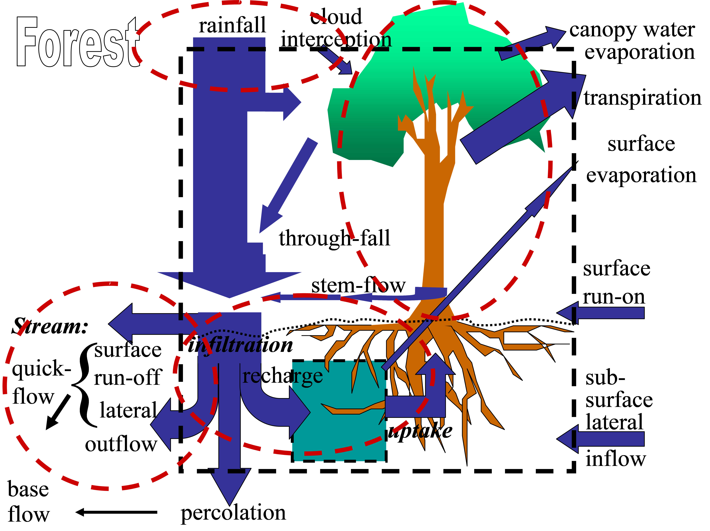
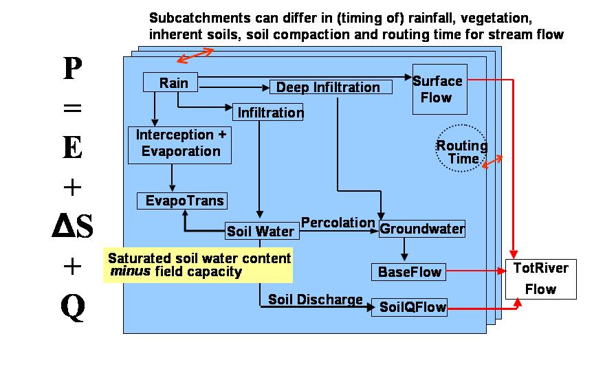
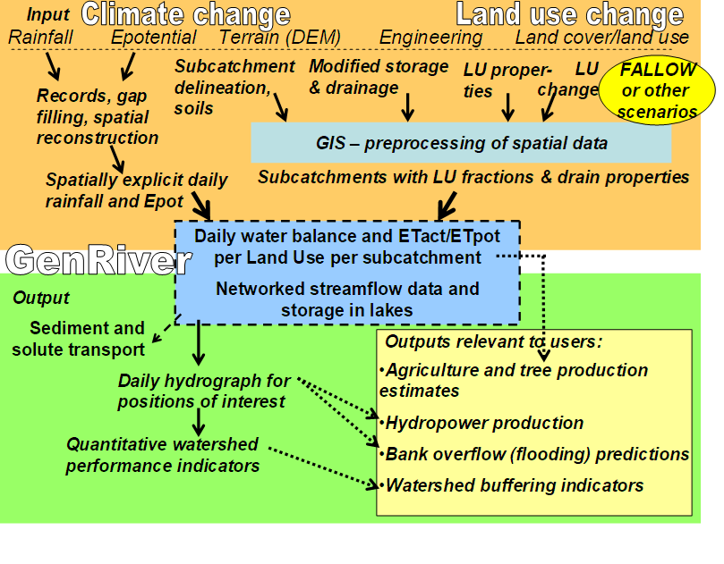

### Preface

Water flow in rivers is generated by rainfall and modified by landscape topography, vegetation, and soil, but also by human engineering to enhance drainage and/or retention of water. The degree to which river flow is influenced by land cover change (‘deforestation’, ‘reforestation’, ‘agroforestation’, and other code words) is hotly debated, as is the influence of ‘climate change’. A simple tool that relates the logic at the plot level to the river-level consequences was deemed relevant to assist in the analysis of catchment data. Existing models were either too complex and data-hungry or left out important processes, such as the impact of land use change in the soil and its physical condition.

GenRiver is a generic river flow model that responds to spatially explicit rainfall and keeps track of a plot-level water balance that responds to changes in vegetation and soil. The model treats a river as a summation of streams, each originating in a sub-catchment with its own daily rainfall, yearly land cover fractions, and routing time based on the distance to the river outflow (or measurement) point. Interactions between streams in their contribution to the river are considered to be negligible (i.e. there is no 'backflow' problem). Spatial patterns in daily rainfall events are translated into average daily rainfall in each sub-catchment in a separate module (Spatrain). The sub-catchment model represents interception, infiltration into the soil, rapid percolation into the subsoil, the surface flow of water, and rapid lateral subsurface flow into streams with parameters that can vary between land cover classes.

## General Information

### GenRiver Model Overview

Land cover change can significantly affect watershed functions through a) changes in the fraction of rainfall that reaches the ground, b) the subsequent path-ways of water flow over and through the soil as related to surface and subsurface structure of the soil, surface roughness, and landscape drainage, and c) the rate of water use by plants (Fig. 1.1). 


Figure 1.1 Multiple influences of tree cover and (forest) soil condition in terms of the water balance

Simple characteristics of the vegetation (monthly pattern of leaf biomass, influencing canopy interception and transpiration, and ability to extract water from deeper soil layers) and soil (especially compaction of the macro pores in the soil that store water between ‘saturation’ and ‘field capacity’) can probably explain a major part of the impacts on river flow.

Empirical assessment of the dynamics of water flows as a function of land cover change and soil properties takes time and resources, and needs to take temporal and spatial variation of rainfall into account. A model based on ‘first principles’ that integrates land cover change and change in soil properties as driving factors of changes in river flow can be used as a tool to explore scenarios of land use change if it passes a ‘validation’ test against observed data.


Figure 1.2 Landscape-scale processes that relate the spatial and temporal aspects of rainfall to river flow 

GenRiver is a generic river model on river flow.  As is common in hydrology, it starts the accounting with rainfall or precipitation (P) and traces the subsequent flows and storage in the landscape, which can lead to either evapotranspiration (E), river flow (Q), or change in storage (ΔS) (Figure 1.3):

P = Q + E + ΔS

Models differ in the relations between the different terms of the balance equation and in the way they account for the ‘slow flows’, that derive from water that infiltrates into the soil but can take a range of pathways, with various residence times, to reach the streams and rivers, depending on landform, geology and extractions along the way.

The core of the GenRiver model is a ‘patch’ level representation of a daily water balance, driven by local rainfall and modified by the land cover and land cover change and soil properties of the patch.  The patch can contribute to three types of stream flow: surface-quick flow on the day of the rainfall event, soil-quick flow on the next day, and base flow, via the gradual release of groundwater.

A river is treated as a summation of streams, each originating in a sub-catch¬ment with its own daily rainfall, yearly land cover fractions, and constant total area and distance to the river outflow (or measurement) point.  Interactions between streams in their contribution to the river are considered to be negligible (i.e. there is no ‘backflow’ problem).  Spatial patterns in daily rainfall events are translated into average daily rainfall in each sub-catchment.  The sub-catchment model represents interception, infiltration into the soil, rapid percolation into the subsoil, the surface flow of water, and rapid lateral subsurface flow into streams with parameters that can vary between land cover classes.


Figure 1.3. Overview of the GenRiver model; the multiple subcatchments that make up the catchment as a whole can differ in basic soil properties, land cover fractions that affect interception, soil structure (infiltration rate), and seasonal pattern of water use by the vegetation. The sub-catchment will also typically differ in ‘routing time’ or in the time it takes the streams and river to reach the observation point of main interest


Figure 1.4 GenRiver model, key types of input, and main output


## How to run the software

GenRiver3 software is web application and the **online** version is available at: https://genriver.agroforestri.id/

The software can also be launched as a standalone app using R and RStudio. Following is the step-by-step to run the software from the source code as a standalone app.

### Installation Instructions
1. Install R from [CRAN](https://cran.r-project.org/).
2. Install RStudio from [RStudio](https://www.rstudio.com/products/rstudio/download/).
3. Install the Shiny package in R:
    ```R
    install.packages("shiny")
    ```

### Launching the App
1. Open RStudio.
2. Load the Shiny library:
    ```R
    library(shiny)
    ```
3. Run the app directly from GitHub source code:
    ```R
    shiny::runGitHub("genriver", "degi")
    ```
    Another option is to download all the source codes from https://github.com/degi/genriver. Extract all files to a local folder and execute the script below 
    ```R
    runApp("path/to/your/app")
    ```
    > If you have the **source code** on the local folder, you will need an internet connection to run it for the first time. An internet connection is required for updating and initializing the R libraries. Once the updates are completed, you will be able to run the app **without an internet connection**.<br/>
    > *To be noted*: An internet connection might still be required for downloading the DEM. You can go without the internet once you have it in your saved parameters. 

## User Interface Overview


## Glossary ##

- **Base flow** is the portion of stream flow that derives from groundwater and is not related to current or recent rainfall.
- **BD/BDref** is the bulk density of a soil layer relative to the ‘reference bulk density’ that can be expected for soil of similar texture under natural forest conditions
- **Buffering capacity** is the ability of a system to reduce the impact of external variation on internal properties, e.g. reducing the variation in stream flow relative to variation in rainfall.
- **Buffering indicator** is derived from the ratio of above-average stream flow and above-average rainfall.
- **Buffering for peak events** is the ‘buffer’ function demonstrated at peak rainfall events.
- **C/Cref** is the organic soil carbon content of a soil relative to the ‘reference soil Corg concentration’ that can be expected for soil of similar texture, pH, and mineralogy under natural forest conditions at the given elevation (temperature regime)
The discharge or Outflow of a river is the volume of water it transports in a certain amount of time. The unit used is usually m³/s (cubic meters per second).
- **Evapotranspiration** is a term used to describe the sum of evaporation and plant transpiration from the earth's land surface to the atmosphere. Evaporation accounts for the movement of water to the air from sources such as the soil, canopy interception, and waterbodies. Transpiration accounts for the movement of water within a plant and the subsequent loss of water as vapor through stomata in its leaves.
- **Field capacity** is the volumetric soil water content measured 1 day after a saturating rainfall event, when rapid drainage and interflow have removed excess water to streams or groundwater
- **Flash floods** are floods caused by heavy or excessive rainfall in a short period, generally under 6 hours. They cause stream flow and water levels to rise and fall rapidly.
- **Flow persistenc**e is the minimum volume of river flow that can be expected as a fraction of flow on the previous day
- **Gradual water release** is a gradual release of (ground) water during periods without rainfall (‘dry season)
- **Groundwater discharge** is the release of groundwater to streams or subsurface flows.
- **Interflow** see Quickflow
- **Low flow** is flow through a watercourse after a prolonged absence of rainfall.
- **Overland flow** see surface runoff 
- **Overflow or Bank overflow** is a flow of water outside of the regular river bed during conditions where recent inflow minus outflow has exceeded the storage capacity.
- **Peak flows** is the maximum flow through a watercourse.
- **Precipitation** is all forms of water particles, whether liquid or solid, that fall from the atmosphere to the ground. Distinguished from cloud, fog, dew, and frost, precipitation includes rain, drizzle, snow, and hail.
- **Quickflow or Interflow** is part of a storm rainfall that moves laterally through hillslope soils to a stream channel; it infiltrates the soil, but cannot be retained by the soil at its ‘field capacity’; shallow groundwater or interflow may emerge at the surface at the bottom of slopes and flow across the ground surface to the stream.
- **Relative buffering indicator** is the ‘buffer’ function adjusted for relative annual water yield
- **River flow** is the flow of water in the river channel
- **Storage capacity** is the total amount of water that can be stored in a reservoir before overflow occurs.
- **Stream flow** is the flow of water in streams, rivers, and other channels.
- **Surface runoff or Overland flow** is the flow across the land surface of the water  when the rainfall rate exceeds the infiltration capacity of the soil. The rate of infiltration, and therefore the possibility of surface runoff, is determined by such factors as soil type, vegetation, and the presence of shallow, relatively impermeable, soil horizons. Saturated overland flow can occur when a temporary rise of the water table inhibits infiltration and causes flow over the surface.
- **Total discharge fraction** is the total water yield (discharge) per unit of rainfall, usually on an annual basis.
- **Water balance** is the comparison over a certain period (e.g. month or year) of inflow of water (precipitation) and outflows by evapotranspiration, stream flow, and subsurface flows.
- **Water quality** is the chemical, physical, and biological characteristics of water concerning its suitability for a particular use.
- **Water storage** is the volume of water that can be (temporarily) withheld from evapotranspiration, stream flow, or subsurface flows, either above ground in lakes, rivers, and other waterways or below ground as groundwater.
- **Water transmission** is the fraction of incoming precipitation that is converted into stream flow.


## Contact Information
For further support, please contact: degi_ecomodels@gmail.com.


*To be updated...*
