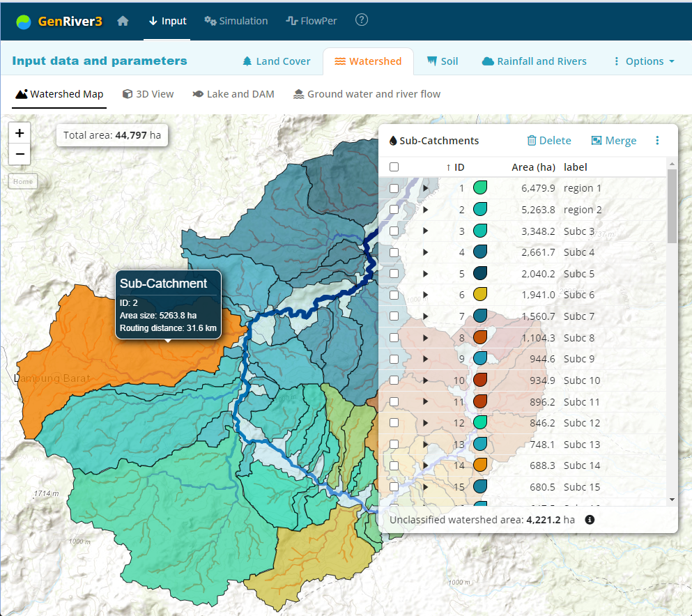

tesssss

- [How to run the software](#how-to-run-the-software)
  - [Installation Instructions](#installation-instructions)
  - [Launching the App](#launching-the-app)
- [Home Screen](#home-screen)
- [Input](#input)
  - [Land Cover](#land-cover)
    - [Land Cover Map](#land-cover-map)
    - [Hydrological Properties](#hydrological-properties)
    - [Evapotranspiration](#evapotranspiration)
  - [Watershed](#watershed)
    - [Watershed Map](#watershed-map)
    - [3D View](#3d-view)
    - [Lake and DAM](#lake-and-dam)
    - [Ground Water and River Flow](#ground-water-and-river-flow)
  - [Soil](#soil)
    - [Physical and Chemical Properties](#physical-and-chemical-properties)
    - [Hydraulic Properties](#hydraulic-properties)
    - [Soil and Plant Water](#soil-and-plant-water)
    - [Soil Erosion and Sedimentation](#soil-erosion-and-sedimentation)
  - [Rainfall and Rivers](#rainfall-and-rivers)
    - [Rainfall](#rainfall)
    - [River](#river)
    - [Consistency Check](#consistency-check)
  - [Options](#options)
- [Simulation](#simulation)
  - [Water Balance](#water-balance)
  - [Watershed Indicator](#watershed-indicator)
  - [Buffering Indicator](#buffering-indicator)
- [FlowPer](#flowper)

---

## How to run the software

GenRiver3 software is web application and the **online version** is available at: **<https://genriver.agroforestri.id/>**

The software can also be launched as a **standalone app** using R and RStudio. The following is a step-by-step guide for running the software from the source code as a standalone app.

### Installation Instructions
1. Install R from [CRAN](https://cran.r-project.org/).
2. Install RStudio from [RStudio](https://www.rstudio.com/products/rstudio/download/).
3. Install the Shiny package in R:
    ```R
    install.packages("shiny")
    ```

### Launching the App
1. Open RStudio.
2. Load the Shiny library:
    ```R
    library(shiny)
    ```
3. Run the app directly from GitHub source code:
    ```R
    shiny::runGitHub("genriver", "degi")
    ```
    Another option is to download all the source codes from [https://github.com/degi/genriver](https://github.com/degi/genriver). Extract all files to a local folder and execute the script below 
    ```R
    runApp("path/to/your/app")
    ```

> If you have the **source code** on the local folder, you will need an internet connection to run it for the first time. An internet connection is required to update and initialize the R libraries. Once the updates are completed, you will be able to run the app **without an internet connection**.<br/>
    
>  **Note:**<br>
> You might still need an internet connection to download the DEM. However, you can go without it once it is in your saved parameters. 

## Home Screen

GenRiver model is a generic model of river flow in a catchment that is subdivided into sub-catchments, with separate dynamics of land cover change and rainfall, and different properties for soil parameters and routing distance if desired. The model was developed as a tool to analyze river flow in two catchments in SE Asia: the Way Besai (Sumberjaya) watershed in Lampung Indonesia and Mae Chaem in Northern Thailand; default input parameters are based on the  Sumberjaya case.

The model treats a river as a summation of streams, each originating in a sub-catchment with its own daily rainfall, yearly landcover fractions, and constant total area and distance to the river outflow or measurement point. Interactions between streams in their contribution to the river are considered to be negligible (i.e. there is no 'backflow' problem). Spatial patterns in daily rainfall events are translated into average daily rainfall in each sub-catchment in a separate module. The sub-catchment model represents interception, infiltration into the soil, rapid percolation into the subsoil, surface flow of water, and rapid lateral subsurface flow into streams with parameters that can vary between land cover classes.


The main interface for working with the model is divided into sections titled **Input**, **Simulation**, and **Flopper**.

- **Input:** The input parameters required for running the model
- **Simulation:** Run the model simulation after the required parameters are completed
- **Flopper:** Analyzing the river flow persistence

## Input

### Land Cover

**Land cover** is one of the main factors in the watershed dynamics. A time series of land cover maps follows the dynamic changes in soil properties. You may provide land cover maps for the observed periods. The boundary box of the land cover map will be used as the area for the DEM query. The DEM is later delineated to generate the watershed boundary.

#### Land Cover Map


Once the map is uploaded, it will be displayed on the page. The map IDs will be displayed on the right side as landcover IDs. A default landcover label is generated for all the IDs. You may edit the landcover label in place, or upload it from a predefined CSV file.    

#### Hydrological Properties

The GenRiver model was set up to compare the impacts of land cover change on hydrology. These impacts are based on four steps in the water cycle: interception by the canopy, impact on the topsoil structure (BD/BDref) that influences infiltration (or runoff generation as its complement), the seasonal pattern of water use (here expressed as the fraction of the potential ET per month), and a drought threshold that indicates the relative soil water content where evapotranspiration is affected. Distinctions between land cover types for any simulation should be based on the primary research question, the availability of data on land cover fractions, and the importance of the land cover type in the catchment area. Most spatial data include a "no data" category (clouds and cloud shadow). normally the fractions of land cover elsewhere are assumed to apply to these pixels as well.


The first column of the first table is the storage capacity for intercepted water (I_InterceptClass) of each land cover type, mm day-1. It is treated as a linear function of leaf + branch area index of the land cover, with the option of modifiers for surface properties that determine the thickness of the water film, forest = 4, young secondary forest/young agroforestry = 3.

The second column is drought limitation to transpiration per land cover class relative to field capacity (I_RelDroughtFact). The values depend on drought resistance, the highest resistance = 1 (teak), and the lowest resistance = 0.1 (Durian).

The third column is **BD/BDref**, which is the bulk density of a soil layer relative to the ‘reference bulk density’ that can be expected for soil of similar texture under natural forest conditions

The second table is the monthly pattern of potential evapotranspiration for each land cover type is calculated by multiplying these monthly values by daily potential evapotranspiration (I_MultiplierEvapoTrans[LandCoverType]). These multiplier values follow the seasonal pattern of crop, tree, and paddy. The highest value = 1 (rice field, pine), and the lowest = 0.1 (houses).

#### Evapotranspiration

**Evapotranspiration** is a term used to describe the sum of evaporation and plant transpiration from the earth’s land surface to the atmosphere. Evaporation accounts for the movement of water to the air from sources such as the soil, canopy interception, and waterbodies. Transpiration accounts for the movement of water within a plant and the subsequent loss of water as vapor through stomata in its leaves.


The potential evapotranspiration, mm day-1 data can be either daily data or monthly data. These values can be derived from open pan evaporation measurements or from equations such as Penman’s that calibrate on such data.


### Watershed

The DEM data is acquired from <a href='https://opentopography.org/' target='_blank'><b>opentopography.org</b></a>. OpenTopography provides open and free access to the DEM dataset. Please visit the website for more information about its data collection. Find the instructions at <a href='https://opentopography.org/citations' target='_blank'> https://opentopography.org/citations</a> for the citation
          


If the DEM download fails. You may do the following:
* Make sure the internet connection is stable
* Try another DEM sources
* Register to  <a href='https://portal.opentopography.org/' target='_blank'>opentopography.org</a> and get your own API key.
Make sure the key was correctly copied into 'API key' input

#### Watershed Map



#### 3D View


#### Lake and DAM


#### Ground Water and River Flow


### Soil

The soil data is acquired from **Harmonized World Soil Database version 2.0** (HWSD v2.0). **HWSD** is a comprehensive global soil inventory that offers detailed insights into soil properties, including their morphology, chemistry, and physical characteristics, with a focus on a 1 km resolution. Please visit <a href='https://www.fao.org/soils-portal/data-hub/soil-maps-and-databases/harmonized-world-soil-database-v20/en/' target='_blank'>**FAO SOILS PORTAL**</a> for more information on the database and their suggested citation

#### Physical and Chemical Properties

Average texture (or soil type in a way that allows texture to be estimated) as input to ‘pedotransfer’ functions to estimate soil water retention curve (saturation, field capacity, wilting point)


, soil is at field capacity. Typically, at field capacity, air is in the macropores, and water in the micropores. Field capacity is viewed as the optimal condition for plant growth and microbial activity. At a potential of −1500 kPa, the soil is at its permanent wilting point, at which plant roots cannot extract the water through osmotic diffusion. <https://en.wikipedia.org/wiki/Water_potential>


####  Soil and Plant Water


#### Soil Erosion and Sedimentation


### Rainfall and Rivers

#### Rainfall

**Rainfall** or **precipitation** is all forms of water particles, whether liquid or solid, that fall from the atmosphere to the ground. Distinguished from cloud, fog, dew, and frost, precipitation includes rain, drizzle, snow, and hail.


A number of formats are possible, as long as they allow a reconstruction of monthly exceedance curves of daily rainfall intensity:
-	30 (or at least 20) years of daily rainfall records for a station that can represent the area (or multiple stations if these are supposed to be similar) or
-	Any ‘rainfall simulator’ equation with the appropriate parameters that can be used to generate a 30-year dataset for the site (e.g. MarkSim).

#### River

If available, river debit data for any period of time (expressed in m3 s-1 in the river or mm day-1 over the whole contributing subcatchments) will be valuable in ‘constraining’ the simulations. If not available, we will simply have to ‘believe’ the model predictions as such


#### Consistency Check


### Options

## Simulation

### Water Balance


- **O_CumRain**	is the cumulative amount of daily rainfall for the whole sub-catchment and vegetation class
- **O_CumPercolation** is the cumulative amount of percolation water for the whole sub-catchment
- **O_CumDeepInfilt**	is a cumulative amount of water deeply infiltrated to the soil for the whole sub-catchment
- **O_CumBaseFlow**	is the cumulative amount of base flow the whole sub-catchment and vegetation class
- **O_CumSoilQFlow** is the cumulative amount of soil quick flow for the whole sub-catchment and vegetation class

### Watershed Indicator

#### Evaluation of Model Performance

Evaluation of model performance can be done by comparing simulation results to measurement data.  Statistical indicators proposed by Nash and Sutcliffe (1970) are used for checking the performance of the model. The performance of the model can also be checked using coefficient correlation or double mass cumulative rainfall-river flow curve. “PerformanceTestGenRiver” is a file consists an explanation of the process of this evaluation.

##### Nash-Sutcliffe Efficiency

The Nash-Sutcliffe efficiency (NSE) is a normalized statistic that determines the relative magnitude of the residual variance (“noise”) compared to the measured data variance (Nash and Sutcliffe, 1970). NSE indicates how well the plot of observed versus simulated data fits the 1:1 line

, with NSE \= 1 being the optimal value. Values between 0.0 and 1.0 are generally viewed as acceptable levels of performance, whereas values \< 0.0 indicate that the mean observed value is a better predictor than the simulated value, which indicates unacceptable performance. The performance of the model and the result will be evaluated annually and will be accepted when NSE criteria are more than 0.50 (Table 2.4).

 **Table 2.4.** Reference Stream flow model Performance (Moriasi, D.N. et. al., 2007\)

| Performance Rating | NSE |
| :---: | :---: |
| Very Good | 0.75\<NSE≤1.00 |
| Good | 0.65\<NSE≤0.75 |
| Satisfactory | 0.50\<NSE≤0.65 |
| Unsatisfactory | NSE≤0.5 |

##### Coefficient of correlation

The coefficient of correlation representing the change direction of simulation data compare with the observation data.

where xi is observation data, yi is simulation result, xmean is mean observation data and ymean is mean simulation.

When applying the GenRiver model to landscapes where at least some river flow data are available, there is an opportunity to assess the ‘lack of fit’ between the model and measurements. Lack of fit can be due to 1\) inaccuracy or error in the data (e.g. with incomplete representation of spatial variability on rainfall, and/or errors in the data records), 2\) suboptimal model parameterization, 3\) error and/or oversimplification in the model process description. Component 3 can only be assessed if components 1 and 2 can be quantified. Tests of data consistency can be used to assess component 1, e.g. at the seasonal aggregate level. Steps can include:

1. SP \- SQ gives an estimate of top total evapotranspiration. Values below 500 or above 1500 mm/year are suspect. These may indicate errors in P or Q registration, errors in the area, or deviation from the ‘closed catchment’ assumption (e.g. subsurface flows out of or into the catchment are non-negligible).  
2. ‘Double Mass’ curves of cumulative SQ versus SP during the year: large jumps will require explanation (see next section).  
3. Flow persistence Qi+I versus Qi plots may indicate gaps in the data or ‘outliers’ that indicate errors (see further in Chapter 5).

#### Analysis of Indicators of Watershed Functions: water quantity and quality

The assessment of the hydrological situation of the watershed is determined by the criteria and indicators of water transmission (total water yield per unit rainfall), buffering capacity (relationship of peak river flow and peak rainfall, linked to flooding risk), and gradual release of (ground) water in the dry season, based on recharge in the rainy season (Table 2.5). These indicators all relate the flows of water to the preceding rainfall and by doing so; allow the analysis of the relatively small land use effects, superimposed on substantial year-to-year variation in rainfall. We provide a file “IndicatorWatershed” to ease users doing this analysis.

**Table 2.5.** Criteria and indicators of watershed hydrological functions that are relevant to downstream stakeholders (Van Noordwijk, et al., 2006\)


### Buffering Indicator


## FlowPer

**Flow persistence** is the minimum volume of river flow that can be expected as a fraction of flow on the previous day


*To be updated...*
