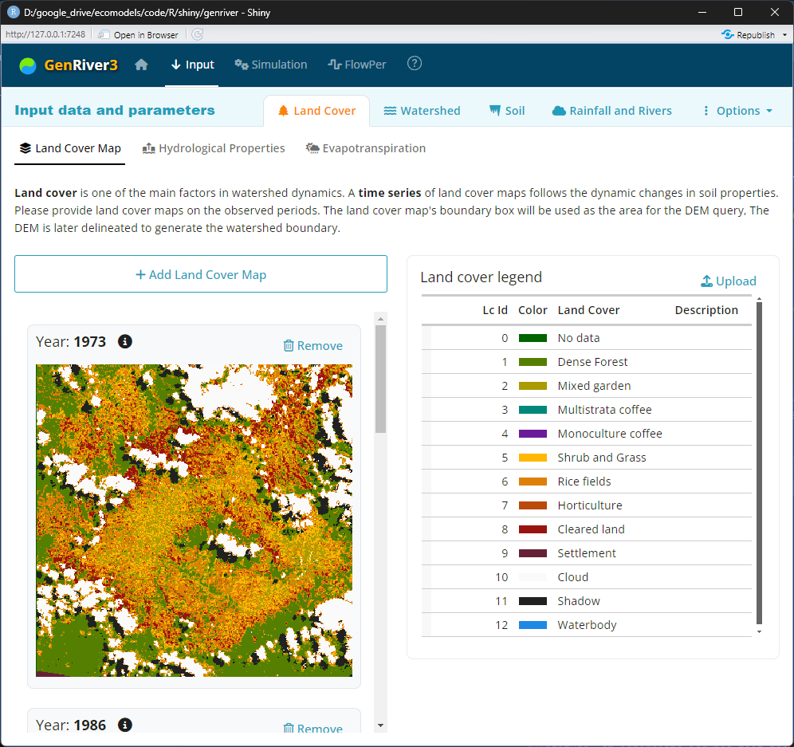
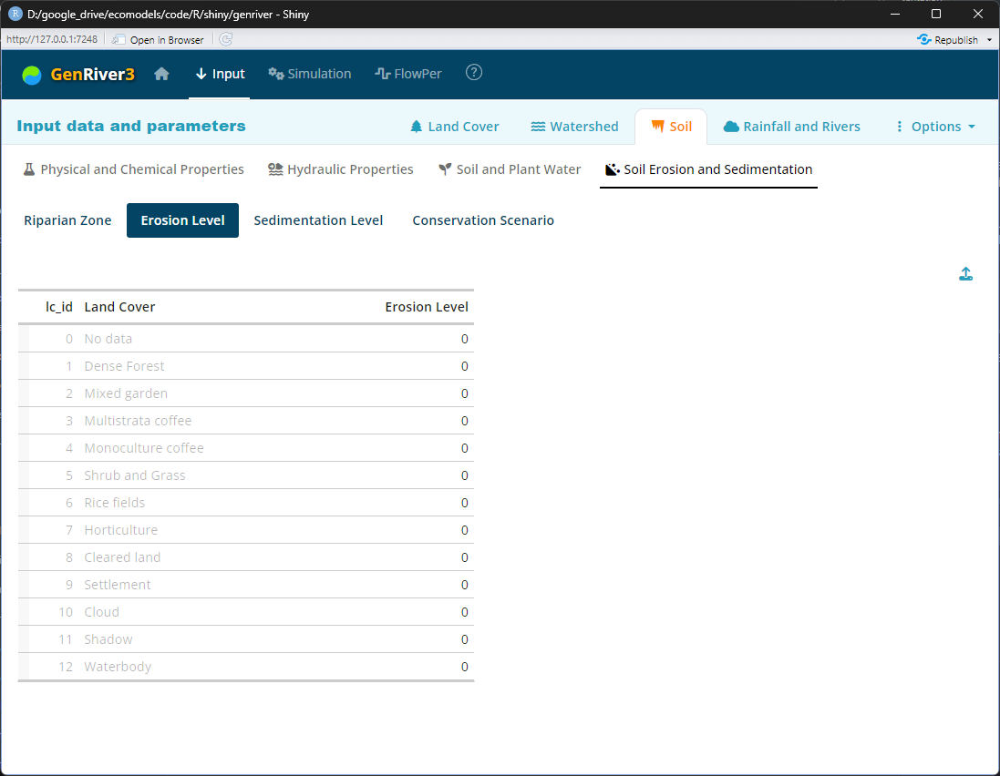

## How to run the software

GenRiver3 software is web application and the **online** version is available at: https://genriver.agroforestri.id/

The software can also be launched as a standalone app using R and RStudio. The following is a step-by-step guide for running the software from the source code as a standalone app.

### Installation Instructions
1. Install R from [CRAN](https://cran.r-project.org/).
2. Install RStudio from [RStudio](https://www.rstudio.com/products/rstudio/download/).
3. Install the Shiny package in R:
    ```R
    install.packages("shiny")
    ```

### Launching the App
1. Open RStudio.
2. Load the Shiny library:
    ```R
    library(shiny)
    ```
3. Run the app directly from GitHub source code:
    ```R
    shiny::runGitHub("genriver", "degi")
    ```
    Another option is to download all the source codes from https://github.com/degi/genriver. Extract all files to a local folder and execute the script below 
    ```R
    runApp("path/to/your/app")
    ```
    > If you have the **source code** on the local folder, you will need an internet connection to run it for the first time. An internet connection is required for updating and initializing the R libraries. Once the updates are completed, you will be able to run the app **without an internet connection**.<br/>
    >
    > *To be noted*: You might still need an internet connection to download the DEM. However, once you have it in your saved parameters, you can go without it. 

## Home Screen


## Input

### Land Cover

#### Land Cover Map



#### Hydrological Properties


#### Evapotranspiration


### Watershed


#### Watershed Map


#### 3D View


#### Lake and DAM


#### Ground Water and River Flow


### Soil

#### Physical and Chemical Properties


#### Hydraulic Properties


####  Soil and Plant Water


#### Soil Erosion and Sedimentation




### Rainfall and Rivers

#### Rainfall


#### River


#### Consistency Check


### Options

## Simulation

### Water Balance


### Watershed Indicator


### Buffering Indicator


## FlowPer


*To be updated...*
