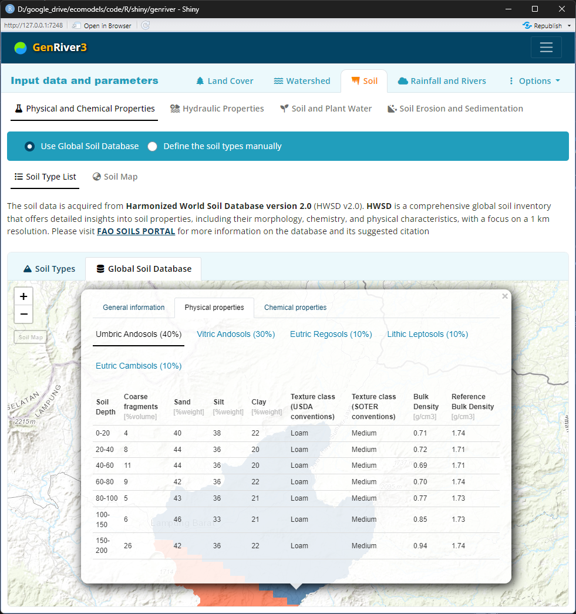
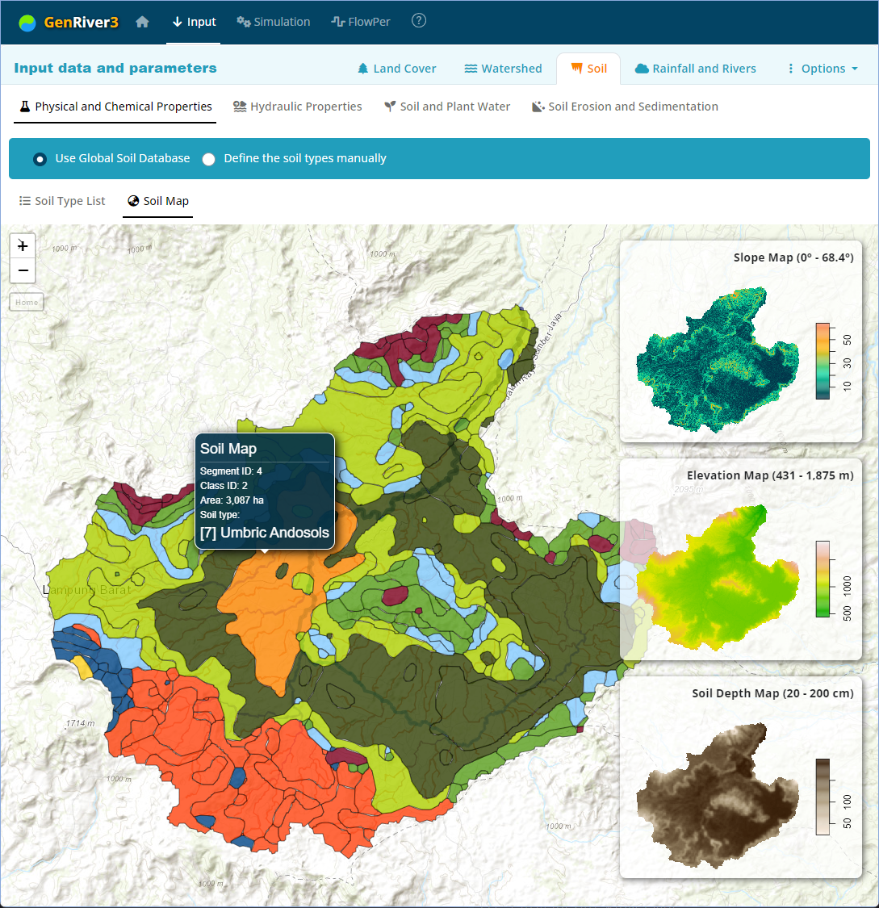
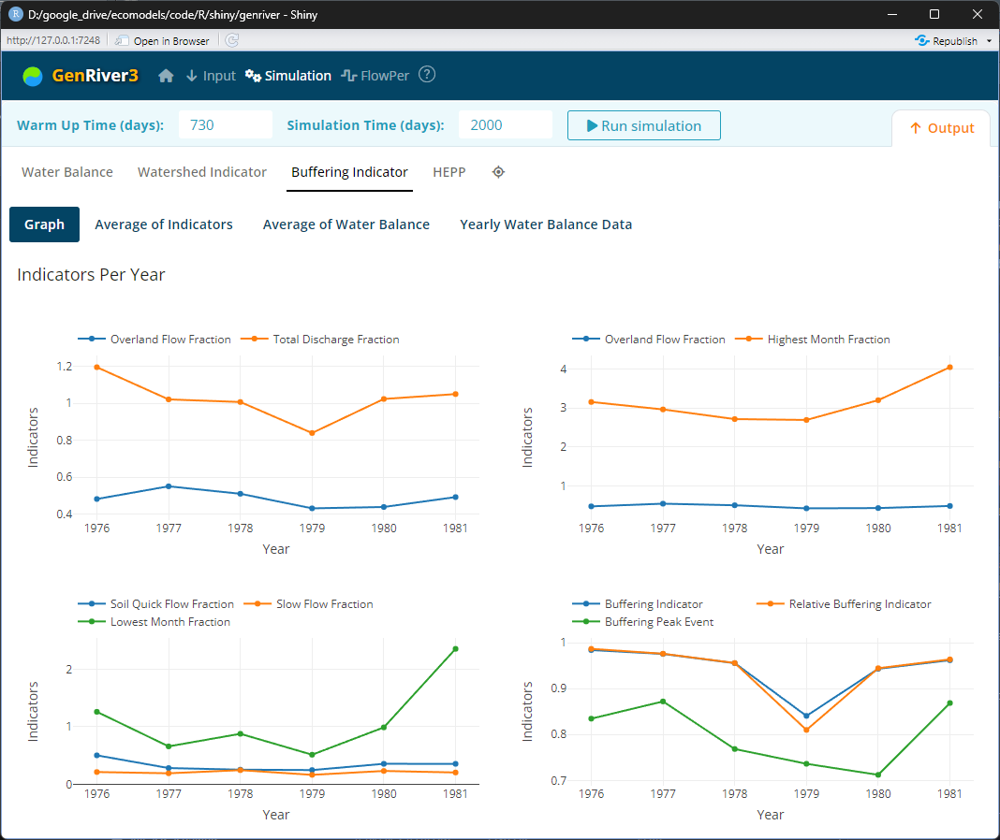

- [How to run the software](#how-to-run-the-software)
  - [Installation Instructions](#installation-instructions)
  - [Launching the App](#launching-the-app)
- [Home Screen](#home-screen)
- [Input](#input)
  - [Land Cover](#land-cover)
    - [Land Cover Map](#land-cover-map)
    - [Hydrological Properties](#hydrological-properties)
    - [Evapotranspiration](#evapotranspiration)
  - [Watershed](#watershed)
    - [Watershed Map](#watershed-map)
    - [3D View](#3d-view)
    - [Lake and DAM](#lake-and-dam)
    - [Ground Water and River Flow](#ground-water-and-river-flow)
  - [Soil](#soil)
    - [Physical and Chemical Properties](#physical-and-chemical-properties)
    - [Hydraulic Properties](#hydraulic-properties)
    - [Soil and Plant Water](#soil-and-plant-water)
    - [Soil Erosion and Sedimentation](#soil-erosion-and-sedimentation)
  - [Rainfall and Rivers](#rainfall-and-rivers)
    - [Rainfall](#rainfall)
    - [River](#river)
    - [Consistency Check](#consistency-check)
  - [Options](#options)
- [Simulation](#simulation)
  - [Water Balance](#water-balance)
  - [Watershed Indicator](#watershed-indicator)
  - [Buffering Indicator](#buffering-indicator)
- [FlowPer](#flowper)

---

## How to run the software

GenRiver3 software is web application and the **online version** is available at: **<https://genriver.agroforestri.id/>**

The software can also be launched as a standalone app using R and RStudio. The following is a step-by-step guide for running the software from the source code as a standalone app.

### Installation Instructions
1. Install R from [CRAN](https://cran.r-project.org/).
2. Install RStudio from [RStudio](https://www.rstudio.com/products/rstudio/download/).
3. Install the Shiny package in R:
    ```R
    install.packages("shiny")
    ```

### Launching the App
1. Open RStudio.
2. Load the Shiny library:
    ```R
    library(shiny)
    ```
3. Run the app directly from GitHub source code:
    ```R
    shiny::runGitHub("genriver", "degi")
    ```
    Another option is to download all the source codes from https://github.com/degi/genriver. Extract all files to a local folder and execute the script below 
    ```R
    runApp("path/to/your/app")
    ```

> If you have the **source code** on the local folder, you will need an internet connection to run it for the first time. An internet connection is required to update and initialize the R libraries. Once the updates are completed, you will be able to run the app **without an internet connection**.<br/>
    
>  **Note:**<br>
> You might still need an internet connection to download the DEM. However, you can go without it once it is in your saved parameters. 

## Home Screen


The main interface for working with the model is divided into sections titled **Input**, **Simulation**, and **Flopper**.

- **Input:** The input parameters required for running the model
- **Simulation:** Run the model simulation after the required parameters are completed
- **Flopper:** Analyzing the river and rain data on its persistence

## Input

### Land Cover

**Land cover** is one of the main factors in the watershed dynamics. A time series of land cover maps follows the dynamic changes in soil properties. You may provide land cover maps for the observed periods. The boundary box of the land cover map will be used as the area for the DEM query. The DEM is later delineated to generate the watershed boundary.

#### Land Cover Map


Once the map is uploaded, it will be displayed on the page. The map IDs will be displayed on the right side as landcover IDs. A default landcover label is generated for all the IDs. You may edit the landcover label in place, or upload it from a predefined CSV file.    

#### Hydrological Properties


- **BD/BDref** is the bulk density of a soil layer relative to the ‘reference bulk density’ that can be expected for soil of similar texture under natural forest conditions

#### Evapotranspiration


- Evapotranspiration is a term used to describe the sum of evaporation and plant transpiration from the earth’s land surface to the atmosphere. Evaporation accounts for the movement of water to the air from sources such as the soil, canopy interception, and waterbodies. Transpiration accounts for the movement of water within a plant and the subsequent loss of water as vapor through stomata in its leaves.


### Watershed

The DEM data is acquired from <a href='https://opentopography.org/' target='_blank'><b>opentopography.org</b></a>. OpenTopography provides open and free access to the DEM dataset. Please visit the website for more information about its data collection. Find the instructions at <a href='https://opentopography.org/citations' target='_blank'> https://opentopography.org/citations</a> for the citation
          


If the DEM download fails. You may do the following:
* Make sure the internet connection is stable
* Try another DEM sources
* Register to  <a href='https://portal.opentopography.org/' target='_blank'>opentopography.org</a> and get your own API key.
Make sure the key was correctly copied into 'API key' input

#### Watershed Map


#### 3D View


#### Lake and DAM


#### Ground Water and River Flow


### Soil

The soil data is acquired from **Harmonized World Soil Database version 2.0** (HWSD v2.0). **HWSD** is a comprehensive global soil inventory that offers detailed insights into soil properties, including their morphology, chemistry, and physical characteristics, with a focus on a 1 km resolution. Please visit <a href='https://www.fao.org/soils-portal/data-hub/soil-maps-and-databases/harmonized-world-soil-database-v20/en/' target='_blank'>**FAO SOILS PORTAL**</a> for more information on the database and their suggested citation

#### Physical and Chemical Properties







#### Hydraulic Properties


Soil hydraulic at a potential of 0 kPa is in a state of saturation. At saturation, all soil pores are filled with water, and water typically drains from large pores by gravity. At a potential of −33 kPa, or −1/3 bar, (−10 kPa for sand), soil is at field capacity. Typically, at field capacity, air is in the macropores, and water in the micropores. Field capacity is viewed as the optimal condition for plant growth and microbial activity. At a potential of −1500 kPa, the soil is at its permanent wilting point, at which plant roots cannot extract the water through osmotic diffusion. <https://en.wikipedia.org/wiki/Water_potential>


####  Soil and Plant Water


#### Soil Erosion and Sedimentation


### Rainfall and Rivers

#### Rainfall


#### River


#### Consistency Check


### Options

## Simulation

### Water Balance


### Watershed Indicator


### Buffering Indicator



## FlowPer


*To be updated...*
